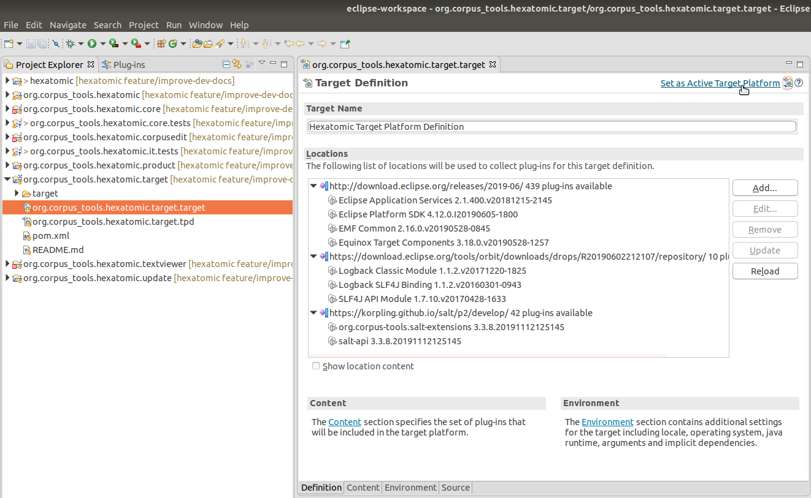

# Creating and activating the target platform

The set of bundles that are available in Eclipse to run Hexatomic is defined by the bundles in your workspace (i.e., the Hexatomic bundles), and additionally the bundles in the active *target platform*.
When you first start Eclipse, this target platform only includes the bundles that are installed in your Eclipse IDE installation.
Hexatomic needs another set of bundles to run.
As these bundles are not available when you first start Eclipse, it will show numerous errors for Hexatomic projects.
This is because Eclipse cannot find the bundles that Hexatomic needs in the currently active target platform.

The bundles that Hexatomic needs are defined in a custom target platform definition project, which is located in the `releng/org.corpus_tools.hexatomic.target/` directory.

You can see this project in the Project Explorer in Eclipse.
It contains the important `org.corpus_tools.hexatomic.target.target` file,
which is an XML file describing the target platform so that the Eclipse IDE can
read it and activate it.

The first time you run Eclipse - and every consecutive time that the target platform definition changes - you will need to activate the target platform.
To do so, open `org.corpus_tools.hexatomic.target.target` (you may have to right-click and choose **Open With** > **Target Editor**).
On opening the Target Editor, Eclipse will resolve the plugins in the target platform definition.
Wait until this has finished, then click the **Set as Active Target Platform** link on the top-right of the Target Editor.

Any errors related to unresolvable imports should now be gone after Eclipse has automatically built the projects in the workspace.

To learn more about target platforms in Eclipse, read the [Eclipse Target Platform Tutorial](http://web.archive.org/web/20191128121621/https://www.vogella.com/tutorials/EclipseTargetPlatform/article.html) by Lars Vogel.
