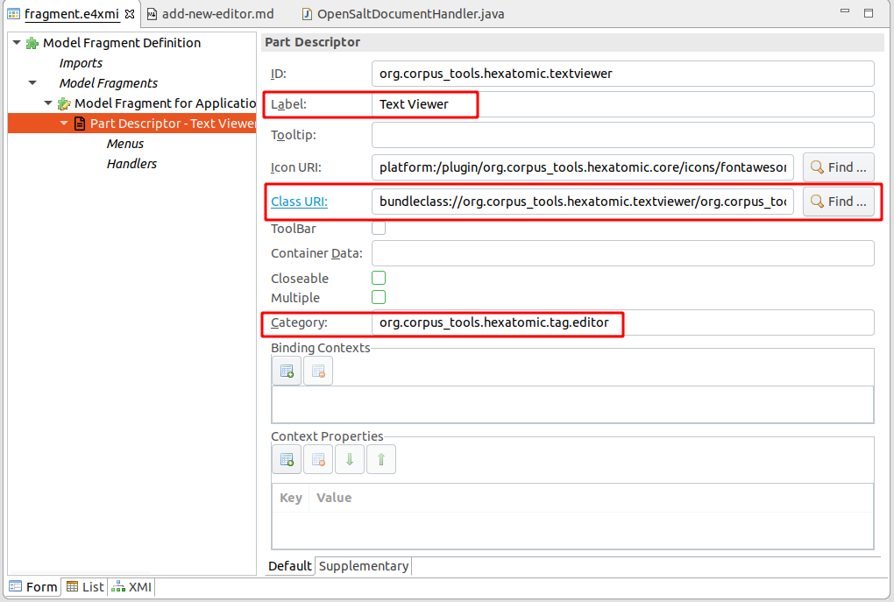

# Adding a new editor

Following the principle of "[separation of concerns](https://en.wikipedia.org/wiki/Separation_of_concerns)", editors should generally be developed in separate, dedicated bundles in the `bundles` directory of the project.
Exceptions to this rule should be based on compelling reasons for including an editor in an existing bundle project.
Reasons may include, for example, that the architectural overhead for creating a very simple editor may be too high.
In cases of uncertainty, follow the rule that changes to software should keep the maintenance effort in proportion to the benefit of the change, and generally as small as possible.

In Eclipse 4, additions to the user interface are organized in so-called [Parts](http://web.archive.org/web/20190807184652/https://www.vogella.com/tutorials/EclipseRCP/article.html#parts).
A part consists of two components:

- a `PartDescriptor` entry in the `fragment.e4xmi` file of the bundle containing the new editor, and 
- the actual Java class implementing the behavior.

## Adding a minimal Java class

Add a Java class to your bundle project.
This class does not need to inherit any interface, but should have a method with the `@PostConstruct` annotation.
```java
public class TextViewer {
	@PostConstruct
	public void postConstruct(Composite parent, MPart part, ProjectManager projectManager) { 
		// TODO: add actual editor implementation
	}
}
```
This example injects the SWT `parent` composite which can be used to construct user interface elements and the `part` parameter, which describes the application model for this part.

SWT ("Standard Widget Toolkit") is the default user interface widgets toolkit for Eclipse-based applications, such as Hexatomic, and is used in this example.
For more information, see the [Eclipse SWT project website](http://web.archive.org/web/20191025084609/https://www.eclipse.org/swt/).
For information on the application model of Eclipse-based applications, see the [Eclipse Wiki page on the UI model](https://web.archive.org/web/20180128210911/https://wiki.eclipse.org/Eclipse4/RCP/Modeled_UI).

The `projectManager` is an Hexatomic specific service that provides access to the global Salt project which is currently loaded.
You can directly add the SWT instructions to define your user interface or the the [Eclipse Window Builder](https://www.eclipse.org/windowbuilder/) for a graphical editor.

## Add part to application model

To add the newly created class to the Eclipse RCP 4 application model, open the `fragment.e4xmi` file of the existing bundle or create a new one with `File -> New -> Other` menu and choosing "New Model Fragment".


In the fragment editor, add a new model fragment by selecting "Model fragments" and clicking on the "Add" button.


Edit the model fragment properties by selecting the newly created entry.
Make sure to the the extended element ID to `xpath:/`and the feature name to `descriptors` (1).
This means that the model fragment extends the part descriptors of the application.
Then, add a new part descriptor with the `Add` button (2). 


Select the new part descriptor in the model fragment editor and you can edit several properties, like the caption of the part or an icon.
Make sure to set the "Class URI" field to the newly created editor class.
You can use the "Find" button to navigate the workspace and insert the proper value.
Also, the "Category" should be set to `org.corpus_tools.hexatomic.tag.editor` to mark that this part is an Hexatomic editor. 
The `Label`field will be used as a name for the editor, e.g. when the user has a selection of editors to choose from for opening a document.




## Get the associated Salt document to display

When an editor part is created, it is initialized with a state. 
This state can hold internal configurations, but also contains the ID of the Salt document that this editor should edit.
The actual ID is set to the editor part's state in the class handling user actions to open a Salt document, `org.corpus_tools.hexatomic.core.handlers.OpenSaltDocumentHandler`.
<!-- TODO Add link to API docs for this class on GitHub Pages once they exist. -->
It is stored in the part state in a setting with the name `org.corpus_tools.hexatomic.document-id`.
The injected `ProjectManager` can then be used to get the actual document.

```java
String documentID = part.getPersistedState()
	.get("org.corpus_tools.hexatomic.document-id");
Optional<SDocument> doc = projectManager.getDocument(documentID);
```
