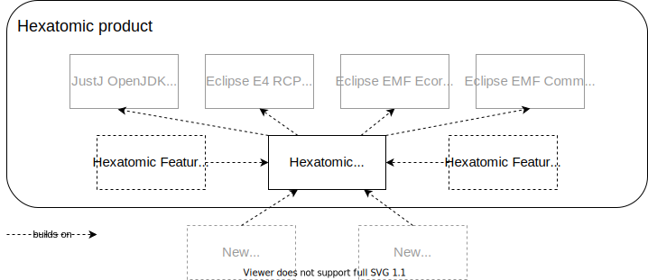

# Architecture

Considerations regarding the architecture of Hexatomic are driven by
the requirement that Hexatomic is **extensible**, and can be used
for different kinds of corpus linguistic research.

The most essential architectural feature of Hexatomic is therefore a high degree of **modularization**. 
This means that whatever feature should be added to Hexatomic, it should be added as a new module,
while at the same time the existing code base needs as few changes as possible.

For different stakeholders in Hexatomic, the architecture should cater for their respective needs:

- *Linguistic researchers* expect a seamless experience in using the software,
and should be able to achieve their research goals without having to use other tools
during their research workflow.
- *Maintainers* expect a clean overview of the architecture, and to
be able to locate different parts easily.
- *Developers* expect to be able to add new features with minimum effort,
in cleanly encapsulated modules, against well-defined and documented interfaces.

## Modularization

Hexatomic is implemented as a desktop application based on an application framework,
the *Eclipse Rich Client Platform* (RCP). 
This framework has its own terminology with regard to its architectural components. 
The following sections introduce some of the relevant terms and relate them to Hexatomic.

### The building blocks of Hexatomic

#### Product

Hexatomic is a **product**: a standalone software program built with the Eclipse RCP.
It is defined and configured in the `releng/org.corpus_tools.hexatomic.product/org.corpus_tools.hexatomic.product` file.
The contents of a product are its [features](#features).

#### Features

Features are sets of [plugins](#plugins). They can also contain other features.
Features represent larger, but logically separate units, for example tooling for a specific annotation task.
This may include a specific editor UI, its annotation logic, and other related functionality.

Hexatomic contains several features.
Most of them come from the Eclipse RCP platform,
but one of them also contains a Java Runtime Environment (JRE) that is shipped together with Hexatomic,
so that users don't have to download and install a JRE to be able to run Hexatomic.

Finally, the Hexatomic product also contains the Hexatomic core feature, 
which contains all the parts that make Hexatomic software for linguistic research.
The core feature is [described further below](#the-hexatomic-core-feature).

The following figure shows a product-level view of Hexatomic's architecture.

##### Features as main unit of modularization

Features are also the main "unit of modularization".
This means that Hexatomic is extended through the inclusion of additional features.
This inclusion can happen in two ways:

1. Additional features are added to the Hexatomic product via its product definition file, see the [section on Hexatomic as a product](#product).
This way, the additional features are shipped as part of the Hexatomic standalone software.
2. Additional features are added to Hexatomic *at runtime*, i.e., when it is being run.
This way, users can extend Hexatomic "on-the-fly" while they use it, by downloading and installing additional features.
To enable the installation of new features at runtime, they must be available in a *p2 repository*.
A p2 repository is an accessible folder structure that contains features and their plugins, 
but also metadata files that can be read by Eclipse RCP products through their update and installation mechanism.

#### Plugins

Finally, **plugins** are the smallest deployable and installable software component in the Eclipse RCP world.
They encapsulate cleanly separated functionality.
For example, there is a Hexatomic plugin which only deals with different linguistic formats, i.e.,
their conversion into and from Hexatomic's data model.

On a technical level, Hexatomic plugins (and Eclipse RCP plugins in general) are also *OSGi bundles*.
OSGi is a modularization framework for Java, and Eclipse Equinox - which is contained in the Eclipse RCP platform - is the OSGi reference implementation.

## The Hexatomic core feature

## When to create features and when to create plugins

