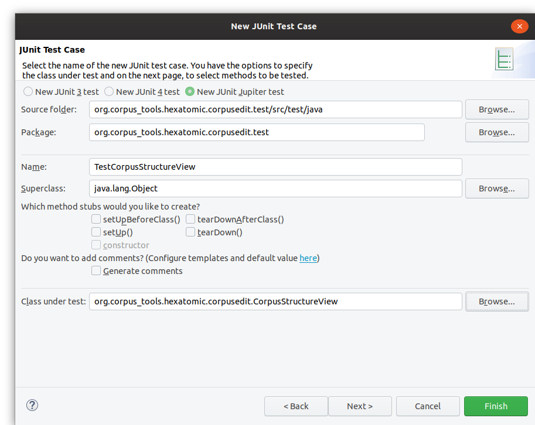

# Automated tests

We use the [JUnit5](https://junit.org/junit5/) testing framework to automate tests.
As per convention in Eclipse RCP applications, tests are located in seperated test bundles and not part of the original
bundle which is tested.
In Hexatomic, all test bundles should be located in the `tests/` folder.

Unit tests test the behavior of a specific class of a bundle.
They should be part of a test bundle with the same name as the original one, but with the string `.test` appended.
E.g. tests for classes of the `org.corpus_tools.hexatomic.core` bundle should be part of the 
`org.corpus_tools.hexatomic.core.tests` bundle.
If add a new bundle, always also create a corresponding test bundle.

## Execute tests with Maven

We are using the [Tycho Surefire Plugin](https://www.eclipse.org/tycho/sitedocs/tycho-surefire/tycho-surefire-plugin/) 
to execute the tests.
Tests are executed when building the project with `mvn install`.
To specifically run the tests and not install the artifacts, use `mvn integration-tests` instead (`mvn test` will not work
due to how Tycho Surefire is configured).

## Execute tests in Eclipse

Open the corresponding test bundle project for the bundle you want to test.
Select the project in the "Project Explorer", right click on it and choose `Run As -> JUnit  Plug-in Test".

This will open a new panel with the results of the tests once finished.
You can select to re-execute a single test by clicking on it and choosing "Run" or "Debug".

### Adding a test bundle project

To create a new test bundle, select `File -> New -> Other` in the Eclipse menu.
In the list of wizard, select `Plug-in Development -> Fragment Project` and click "Next".
Fragment plugins are similar to normal ones, but they extend an existing plugin (the one thats tested) and have access
to all the internal classes and functions of existing host plugin.

The wizard will now ask for some basic properties of the new project.
Use the bundle name with `.test` appended as project name and make sure not to use the default location, but a folder
with the project name under the `tests` folder in your Hexatomic source code folder.
Also, set the "Source folder" to `src/test/java` and the "Output folder" to `target/classes`.
When you configured the basic project properties, click on "Next".

Since this is a fragment project, select the "Plug-in ID" of the "Host Plug-in" that is tested in the next step of the wizard.
You should make sure the "ID" and "Version" of the test are set to the correct values. 
The version should always be the same as the tested bundle.
Click in "Finish" to create the new project.

###  Adding a test case class

If you have an existing test bundle project, you can add a new JUnit Test Case by clicking right on the `src/test/java` folder
in the project explorer and selecting `New -> Other` in the context menu.
In the wizard, select `Java -> JUnit -> JUnit Test Case` and click on "Next".

In the properties of the test case, make sure to seelct "New JUNIT Jupiter test" to create a JUnit5 test.
Also, select the class you want to test in the `Class under test` field.
Click "Finish" to create the empty class or "Next" if you want to add tests for specific functions of the tested class.

