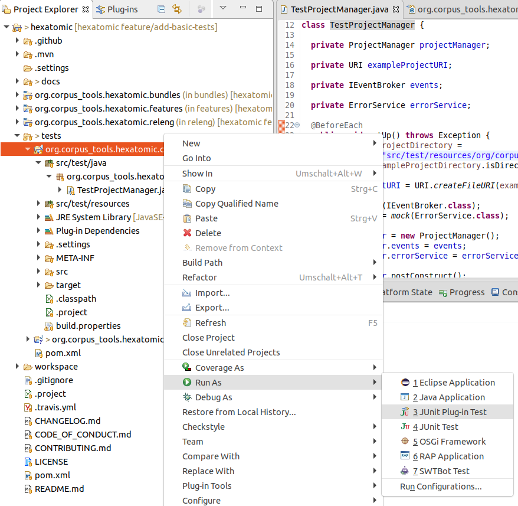
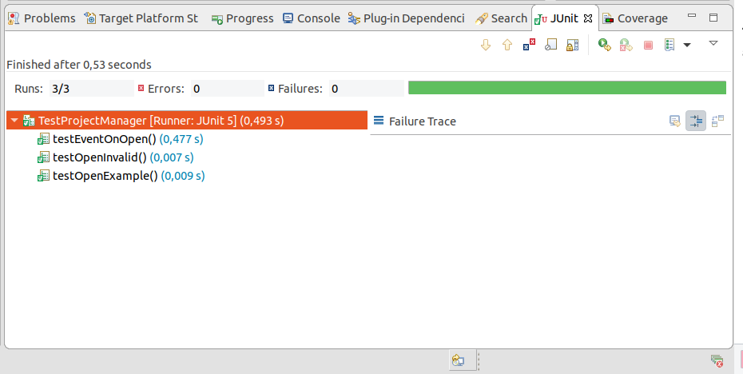
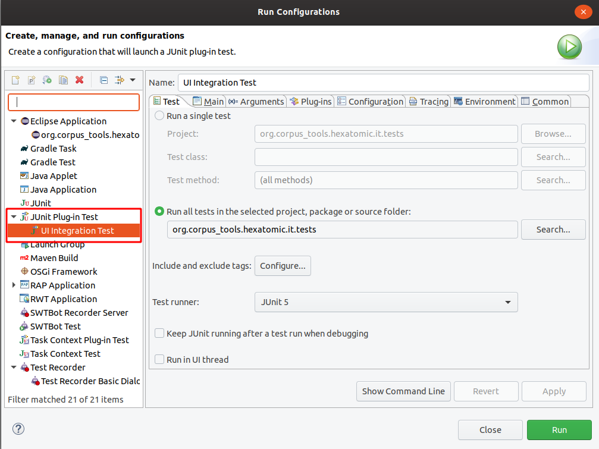

# Automated tests

We use the [JUnit5](https://junit.org/junit5/) testing framework to automate tests.
As per convention in Eclipse RCP applications, tests are located in seperated test bundles and not part of the original
bundle which is tested.
In Hexatomic, all test bundles should be located in the `tests/` folder.

Unit tests test the behavior of a specific class of a bundle.
They should be part of a test bundle with the same name as the original one, but with the string `.test` appended.
E.g. tests for classes of the `org.corpus_tools.hexatomic.core` bundle should be part of the 
`org.corpus_tools.hexatomic.core.tests` bundle.
If add a new bundle, always also create a corresponding test bundle.

The special bundle `org.corpus_tools.hexatomic.it.tests` is used for integration tests on the whole application.

## Execute tests with Maven

We are using the [Tycho Surefire Plugin](https://www.eclipse.org/tycho/sitedocs/tycho-surefire/tycho-surefire-plugin/) 
to execute the tests.
Tests are executed when building the project with `mvn install`.
To specifically run the tests and not install the artifacts, use `mvn integration-tests` instead (`mvn test` will not work
due to how Tycho Surefire is configured).

## Execute tests in Eclipse

Open the corresponding test bundle project for the bundle you want to test.
Select the project in the "Project Explorer", right click on it and choose `Run As -> JUnit  Plug-in Test".

This will open a new panel with the results of the tests once finished.
You can select to re-execute a single test by clicking on it and choosing "Run" or "Debug".

To run the user interface integration test in the `org.corpus_tools.hexatomic.it.tests` bundle, select the project and
choose `Run -> Run Configurations...` in the main menu.
An "UI Integration Test" configuration should be available under the category "JUnit Plug-in Test".
Click on "Run" to execute the user interface integration tests.

