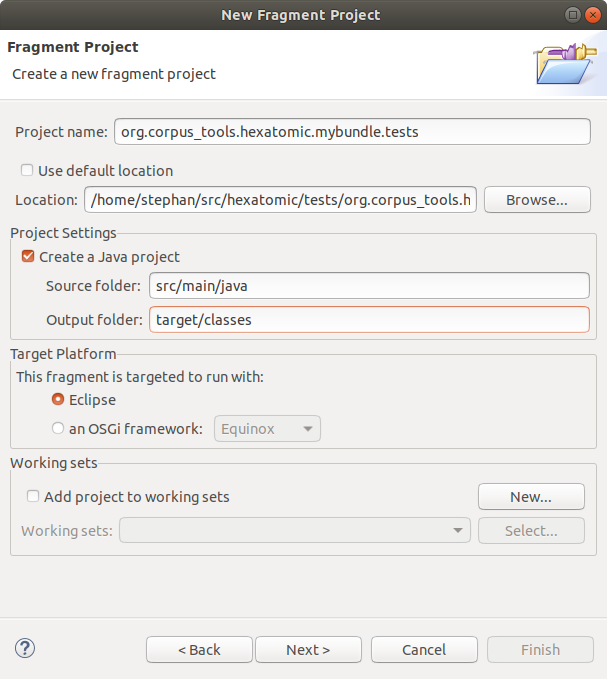
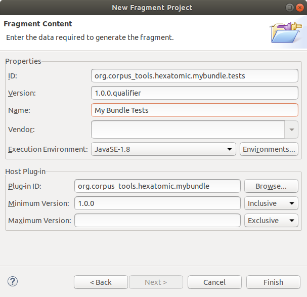

# Adding a test bundle

To create a new test bundle, select **File** > **New** > **Other** in the Eclipse menu.
In the list of wizards, select **Plug-in Development** > **Fragment Project** and click **Next**.
Fragment bundles are similar to normal ones, but they extend an existing bundle (the one that is tested) and have access
to all the internal classes and functions of the existing host plugin.

The wizard will now ask for some basic properties of the new project.
Use the bundle name with `.test` appended as project name and make sure not to use the default location, but a folder
with the project name under the `tests` folder in your Hexatomic source code folder.
Also, set the "Source folder" to `src/main/java` and the "Output folder" to `target/classes`.
When you configured the basic project properties, click on "Next".

Since this is a fragment project, select the "Plug-in ID" of the "Host Plug-in" that is tested in the next step of the wizard.
You should make sure the "ID" and "Version" of the test are set to the correct values. 
The version should always be the same as the tested bundle.
Click in "Finish" to create the new project.

