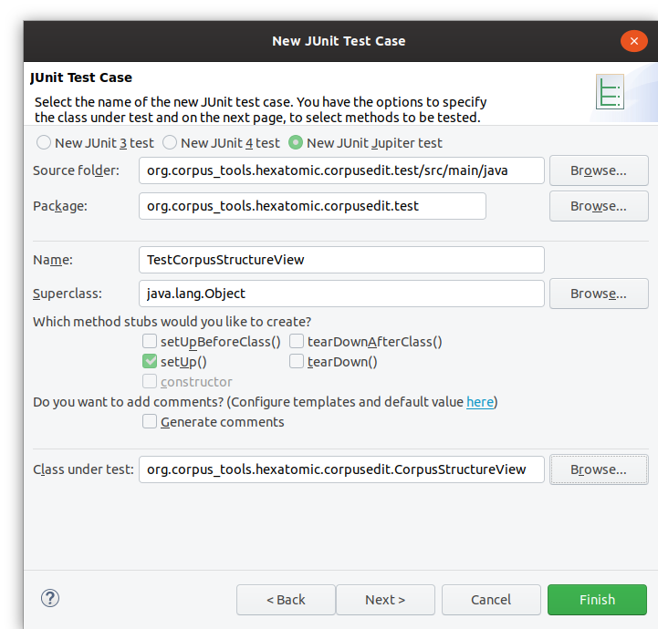

# Adding a test case

If you have an existing test bundle project, you can add a new JUnit Test Case by clicking right on the `src/test/java` folder
in the project explorer and selecting `New -> Other` in the context menu.
In the wizard, select `Java -> JUnit -> JUnit Test Case` and click on "Next".

In the properties of the test case, make sure to seelct "New JUNIT Jupiter test" to create a JUnit5 test.
Also, select the class you want to test in the `Class under test` field.
Click "Finish" to create the empty class or "Next" if you want to add tests for specific functions of the tested class.

