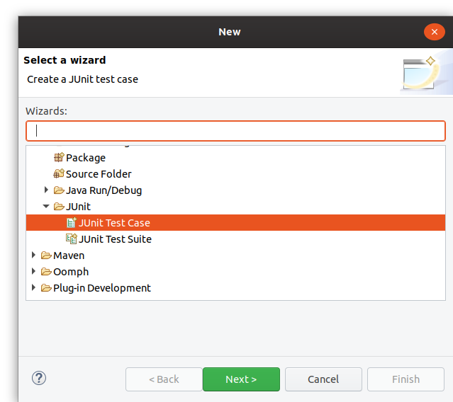
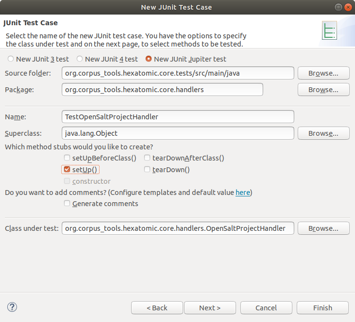

# Adding a test case

If you have an existing test bundle project, you can add a new JUnit Test Case by clicking right on the `src/main/java` folder
in the project explorer and selecting `New -> Other` in the context menu.
In the wizard, select `Java -> JUnit -> JUnit Test Case` and click on "Next".

In the properties of the test case, make sure to seelct "New JUNIT Jupiter test" to create a JUnit5 test.
Also, select the class you want to test in the `Class under test` field.
The "Name" of the test should start with "Test", so that the Tycho test executor is able to identify it as test.
Click "Finish" to create the empty class or "Next" if you want to add tests for specific functions of the tested class.

See the [JUnit5 User Guide](https://junit.org/junit5/docs/current/user-guide/#writing-tests) for a general description
on how to write tests.
