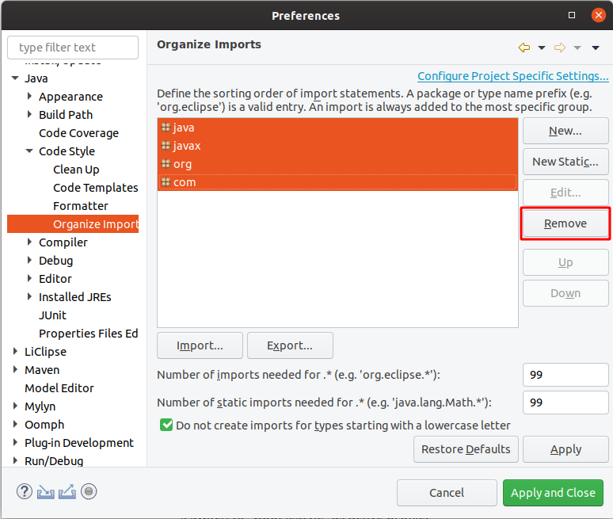

# Coding style and formatting

We are using a derivative of the [Google Java Style Guide](https://google.github.io/styleguide/javaguide.html), which regulates formatting, naming conventions, Javadoc and other stylistic rules for the Hexatomic source code.
In addition to the original style guide, the following rules apply:
- Package names are allowed to have underscores, e.g. `org.corpus_tools.hexatomic` .
- An HTML rendered JavaDoc API page must include all the context necessary to understand all the contents of the page.
- Some Eclipse RCP-specific knowledge should be assumed, e.g., what the `@PreConstruct`/`@PostConstruct` annotations mean.

Some aspects of the coding style will be automatically enforced and checked during continuous integration using the
[Maven Checkstyle plugin](https://maven.apache.org/plugins/maven-checkstyle-plugin/).
Validation of the coding style is also performed whenever you build the project using Maven (e.g., `mvn install`).

## Configuring the Eclipse code formatting

You can configure Eclipse to format your source code according to the Hexatomic Java style.

1. Choose **Window** > **Preferences** from the main Eclipse menu.
2. Open the settings page **Java** > **Code Style** > **Formatter**
3. Select "Import..." and choose the file `releng/ide/eclipse-java-hexatomic-style.xml` in the Hexatomic repository
4. Switch to "Hexatomic Style" as the active profile.  
  
5. Open the settings page **Java** > **Code Style** > **Organize Imports**
6. Select all packages in the list and remove them. 
This configures Eclipse to order all imported packages in alphabetical order.\
\

You can use the keyboard shortcut <kbd>Shift</kbd> + <kbd>Ctrl</kbd> + <kbd>F</kbd> to format a single source code file.
<kbd>Shift</kbd> + <kbd>Ctrl</kbd> + <kbd>O</kbd> will organize the imports.

## Checking for issues in Eclipse

To check for issues with the coding style in Eclipse, select the source code package in the Project Explorer, click right with the mouse and select **Checkstyle** > **Check Code with Checkstyle**. 
This will add warnings to the `Problems` view of Eclipse and add yellow annotations to the source code files.
To remove these annotations again, select the source code package, click right with the mouse and select **Checkstyle** > **Clear Checkstyle violations**.
