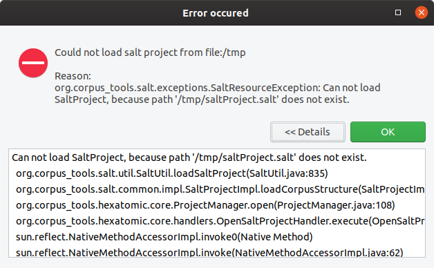

# Logging and error handling

## Logging

Hexatomic uses the SLF4J logging API to log messages.
To enable a logger for a specific class, create a static final variable which holds the class-specific logging object.

```java
private static final org.slf4j.Logger log = 
	org.slf4j.LoggerFactory.getLogger(MyClass.class);
```

You can use this `log` object everwhere in the code to output debug, info, warning or error messages to the console or to the log files. 

```java
int counter = 101;
log.debug("Selecting created document {}.", 101);
```

See the [SLF4J manual](https://www.slf4j.org/manual.html) for more information on the API.

To implement the API, we use the [Logback library](https://logback.qos.ch/) in the `org.corpus_tools.hexatomic.core` bundle.
For testing and debugging purposes, there is a `logback-test.xml` file in the root of the logging bundle. 
This configuration file is loaded whenever Hexatomic is started from Eclipse using the Debug/Run configuration and will output messages on the `debug` level.
When compiling the Hexatomic product, the file `logback.xml` is copied to the product root directory and loaded from there.
This allows a user/developer to customize the logging on their own, even when using a published binary artifact instead of debugging directly from the Eclipse IDE.
Per default, only messages from the `info` level and above are printed to the command line.
See the [Logback documentation](https://logback.qos.ch/manual/configuration.html) how to write or adapt this file.

## Handling exceptions

The core bundle exports the special `org.corpus_tools.hexatomic.core.errors.ErrorService` service which should be used to display error messages to the user.

To report an exception, simply call the `handleException(...)` function of the service with an error message, the exception object, and the class of the caller, i.e., the class in which you catch the exception.
```java
project = SaltFactory.createSaltProject();
try {
	project.loadCorpusStructure(path);
} catch (SaltException ex) {
	errorService.handleException("Cannot load project from " + path.toString(), ex, ProjectManager.class);
}
```
This will produce the following exception dialog, which includes the error message an a stack-trace the user can inspect when selecting "Details" (but is hidden otherwise).



In addition to the dialog, a log entry is added.
This log entry uses the logger for the caller class which has been passed to the `handleException(...)` method.
```plain
18:52:54.324 [main] ERROR o.c.h.c.ProjectManager - Exception occured: Could not load salt project from file:/tmp
org.corpus_tools.salt.exceptions.SaltResourceException: Can not load SaltProject, because path '/tmp/saltProject.salt' does not exist. 
	at org.corpus_tools.salt.util.SaltUtil.loadSaltProject(SaltUtil.java:835) ~[org.corpus-tools.salt-api_3.3.8.20190808115214.jar:na]
	at org.corpus_tools.salt.common.impl.SaltProjectImpl.loadCorpusStructure(SaltProjectImpl.java:148) ~[org.corpus-tools.salt-api_3.3.8.20190808115214.jar:na]
	at org.corpus_tools.hexatomic.core.ProjectManager.open(ProjectManager.java:108) ~[org.corpus_tools.hexatomic.core/:na]
	at org.corpus_tools.hexatomic.core.handlers.OpenSaltProjectHandler.execute(OpenSaltProjectHandler.java:26) [org.corpus_tools.hexatomic.core/:na]
	at sun.reflect.NativeMethodAccessorImpl.invoke0(Native Method) ~[na:1.8.0_232-ea]
```

## Showing error messages

If an error does not originate from an exception, you can use the `showError(...)` function of the error service to display a dialog.
This function takes an optional dialog title, the error message, and the class of the caller as arguments, as shown in the following example.
```java
if (hasChildren) {
	errorService.showError("Error when deleting (sub-) corpus",
			"Before deleting a (sub-) corpus, first delete all its child elements.", this.getClass());
	return;
}
```
This produces both an error dialog and a logging output (without stack trace).


```plain
19:03:26.013 [main] ERROR o.c.h.c.CorpusStructureView$8 - Error when deleting (sub-) corpus: Before deleting a (sub-) corpus, first delete all its child elements.
```
