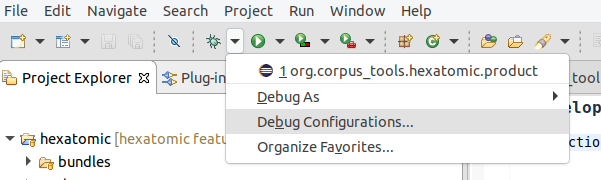
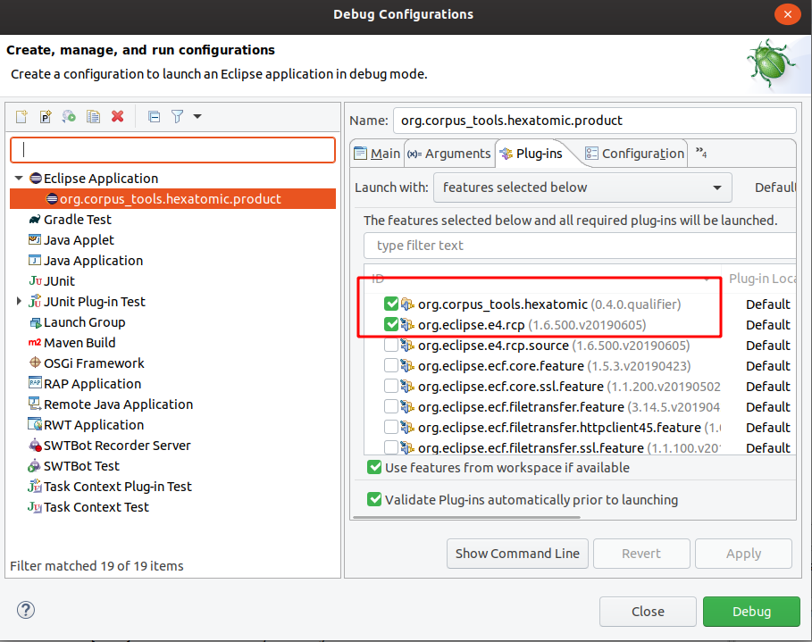

# Running and debugging Hexatomic in Eclipse

Hexatomic is a modular project, and while it is possible to debug a user-defined subset of its bundles,
it may be more useful to debug the complete application.

To run or debug Hexatomic from within the Eclipse IDE, with all the features and bundles, you have to launch the
**org.corpus_tools.hexatomic.product** debug configuration, which is included in the project. 
Choose the debug icon in the toolbar and select **Debug Configurations...**

The launch configuration is shown in the **Eclipse Application** category and you can debug it by clicking on the
**Debug** button.

This launch configuration is based on features.
To add new features, select the **Plug-ins** tab, and activate the features you need.
Changing the product configuration will change the file `releng/ide/eclipse-java-hexatomic-style.xml`, which is part of the Git repository.
