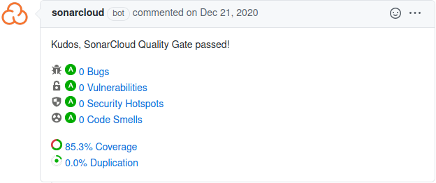

# Continuous integration

When you work on the Hexatomic source code, or the documentation, you naturally diverge
from the state of the default branch of the repository, `develop`.

In order to ensure that your changes don't break anything, and to safeguard the
quality of your changes

- you are required to write tests for your changes, and additionally
- your changes are automatically tested and analysed whenever you push to the
  Git branch you do your work in.

These automated test and analysis runs are done with the help of a *continuous integration (CI)
service*. They are also run during the release process. Hexatomic uses [*GitHub
Actions*](https://docs.github.com/en/actions) as CI service.

## CI workflows

CI workflows define what the CI service should run, and what triggers these runs.

GitHub Actions are configured in the files in `.github/workflows`.
There are different definitions for the [test workflow](#test-workflow) and for
the [release workflow](#release-workflow).

Workflows run in a specified environment and consist of one or more *jobs*, which each consist of one or more
*steps*. Steps can run shell commands, or predefined *actions* that are
available from GitHub. For Hexatomic, the environment that is used to run workflows is a
virtual machine on GitHub's servers running a recent Linux version. 

### Test workflow

The test workflow (`.github/workflows/test.yml`) is run whenever Git commits are pushed to the repository, or when a pull request is opened or updated.
It consists of two separate jobs:

1. A job that builds and tests Hexatomic with the defined Java version and runs
   static code analysis
2. A job that builds and tests the documentation

### Release workflow

The release
workflow (`.github/workflows/release.yml`)
is run whenever Git tags are pushed to the repository that start with a `v`
(e.g., `v0.6.0`). Following the [development workflow for Hexatomic](../../development/workflow/), this should only be
the case during a [release](../releases/).
The release workflow consists of two separate jobs:

1. A job that installs and tests Hexatomic with the defined Java version,
   updates the citation metadata, and deploys the release binaries to GitHub
2. A job that builds the documentation and deploys the built website to the
   `github-pages` branch of the repository, from where GitHub Pages renders it

### Archive workflow

The archive
workflow (`.github/workflows/archive.yml`)
is run whenever Git tags are pushed to the repository.
The release workflow consists of only one job:

1. A job that runs the [Software Heritage Save action](https://github.com/marketplace/actions/save-to-software-heritage)
that triggers the Software Heritage API to save the repository to the archive.

## Static code analysis

We use the static code analysis service SonarCloud to 

- automatically detect potential issues and security threats in our code, and 
- provide information about the portion of code that is covered by tests, and
- provide information of duplication in the code.

Each time, the [test workflow](#test-workflow) is run, it triggers the analysis SonarCloud's servers.
During the analysis, it is checked whether the changes made to the codebase pass a so-called quality gate, i.e., whether threshholds for code quality are met.
The results are being reported, for example on a pull request page.
A failed quality gate also blocks code from getting merged.

You can learn more about the service on the [SonarCloud documentation website](https://sonarcloud.io/documentation).

To access and configure the Hexatomic project in SonarCloud, you must have maintenance access to the Hexatomic repository on GitHub, and log in to SonarCloud at <https://sonarcloud.io>.
