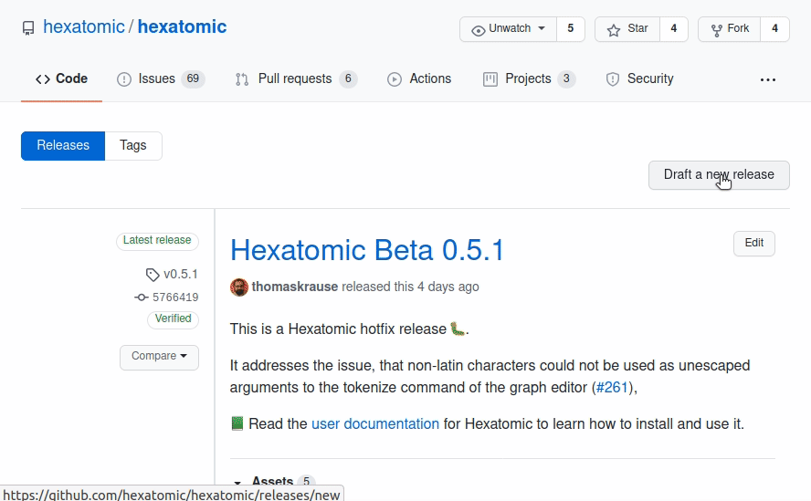

# Releases

Releases are versions of Hexatomic that are marked as encapsulating a specific set of tested and documented functionality features or repairs. Releases have a [version identifier](../versioning/) and are listed on the [releases page](#promoting-releases-on-github) in the Hexatomic repository.

## When to create a release

Hexatomic is a dynamic software project, and therefore there is no release plan with fixed dates for releases.
Instead, the maintainers of Hexatomic decide when to create a new release.
There are, however, two ground rules for when a release is created:

1. Whenever a bug in a previous release of Hexatomic is [hotfixed](../../development/workflow/#contribute-critical-bug-fixes-or-urgent-documentation-or-release-engineering-fixes-for-a-released-version-hotfix), a [new hotfix release](#hotfix-releases) *must* be created.
2. Whenever new functionality has been implemented and merged into the `develop` branch, a [new feature release](#feature-releases) *should* be created.

## Feature releases

To release a new *feature* (i.e., minor) version of Hexatomic, run the following commands in the repository root directory.

1. `git checkout develop` - Checks out the *develop* branch (feature releases are always based on `develop`).
2. `git pull origin develop` - Updates the local *develop* branch.
3. `mvn clean install` - Builds the project, runs tests, and may update the file headers in Java files.
4. `git add .` - Adds the updated files - if any - to the Git index. Make sure you only add intended changes.
5. `git commit -m "Update file headers"` - Commits the updates to version control.
6. `git push` - Updates the remote *develop* branch.
7. `mvn gitflow:release-start` - Starts the release process.
8. The Maven GitFlow plugin will then prompt you to enter a version number for the release. Make sure you enter a version identifier according to semantic versioning, in the format `MAJOR.MINOR.PATCH`. Do *not* use a `-SNAPSHOT` suffix!
9.  Check if the `[Unreleased]` changelog section in `CHANGELOG.md` is complete and up-to-date. Make changes, commit and push if necessary.
10. `mvn keepachangelog:release -N` - Updates the changelog in the release branch.
11. `git add CHANGELOG.md` - Adds the updated changelog to the Git index.
12. `git commit -m "Update changelog"` - Commits the updated changelog to version control.
13. `git push` - Updates the remote release branch.
14. `mvn gitflow:release-finish` - Finalizes the release process.

## Hotfix releases

Hotfixes come into the project via pull requests of a *hotfix branch* against `master`.
**Important**: Do **not** merge pull requests from hotfix branches into master!

Instead, checkout the hotfix branch locally, and start the merge and release process with the Maven GitFlow plugin:

1. `git checkout hotfix/{hotfix version}` - Checks out the respective hotfix branch.
2. `git pull origin hotfix/{hotfix version}` - Checks for any remote changes to the branch.
3. `mvn clean install` - Builds the project, runs tests, and may update the file headers in Java files.
4. `git add .` - Adds the updated files - if any - to the Git index. Make sure you only add intended changes.
5. `git commit -m "Update file headers"` - Commits the updates to version control.
6. `git push` - Updates the remote *hotfix* branch.
7. Check if the `[Unreleased]` changelog section in `CHANGELOG.md` is complete and up-to-date. Make changes, commit and push if necessary.
8. `mvn keepachangelog:release -N` - Updates the changelog in the release branch.
9.  `git add CHANGELOG.md` - Adds the updated changelog to the Git index.
10. `git commit -m "Update changelog"` - Commits the updated changelog to version control.
11. `git push` - Updates the remote release branch.
12. `mvn gitflow:hotfix-finish` - Finalizes the hotfix and finishes the merge and release procedure.

## Promoting releases on GitHub

When you have made a [feature](#feature-releases) or [hotfix](#hotfix-releases) as described above, you will find a new tag for the released version on the [Hexatomic releases page on GitHub](https://github.com/hexatomic/hexatomic/releases).

You can now make a release from this tag:

1. Click on **Draft a new release** on the Releases page.
2. Complete the *Tag version* field with the tag you want to release (e.g. `v0.4.1`).
3. Give the release a title. It should start with `Hexatomic`, include any necessary qualifiers (e.g., `Beta` if it's a `0.` MAJOR version) and the version number itself without any prefixes (e.g., use `0.4.1` instead of `v0.4.1`).
4. Describe the release in three parts:
   1. A high-level description of the form `This is a Hexatomic <hotfix/feature> release <:bug:/:tada:>!` followed by a blank line.
   2. A short description of the fix (including issue numbers with hash prefixes, e.g. `#123`) or the added functionality. You can use bullet lists if more than one fix or feature has been added.
   3. A link to the user documentation with, e.g., the following text: `:green_book: Read the [user documentation](https://hexatomic.github.io/hexatomic/user/v0.5/index.html) for Hexatomic to learn how to install and use it.` Make sure you get the `vMAJOR.MINOR` part in the documentation URL right.
5. Click the **Preview** tab and check if everything looks good.
6. Click on the green **Publish release** button. You can always delete and re-create releases from tags if something goes wrong.
7. Check if the release contains all "binaries", i.e., the product .zip files for all three major operating systems.

## Promoting releases to the community

Hexatomic has a mailing list for users: `hexatomic-users@lists.hu-berlin.de`.
The maintainers of the Hexatomic software project are also [maintainers of this mailing list](TODO).
Whenever a new version of Hexatomic is released, the mailing list should be notified of this.
To do so, write an email to `hexatomic-users@lists.hu-berlin.de` using the following template.
Replace the \<PLACEHOLDERS\> with the actual values.

> **Subject:** Hexatomic \<VERSION NUMBER OF THE NEW VERSION\> is released!
> 
> **Body:**  
> Dear list,
>
> We have released a new version of Hexatomic (\<FULL VERSION NAME OF THE NEW VERSION, e.g., 0.6.0 Beta\>). You can download it here: https://github.com/hexatomic/hexatomic/releases/tag/\<TAG FOR THE NEW VERSION\>.
> 
> \<BRIEF SUMMARY OF THE CHANGELOG, MENTION THE MOST IMPORTANT CHANGES\>
> 
> If you have questions or feature requests, please open an issue on the Hexatomic GitHub repository: https://github.com/hexatomic/hexatomic/issues/new/choose.
> 
> Many thanks!  
> \<NAME OF THE MAINTAINER\>

## What to do when releases go wrong?

When a feature release doesn't work as expected, simply

1. Checkout the `develop` branch (`git checkout develop`).
2. Delete the release branch for the version you wanted to release (`git branch -d release/{version}`).
3. Delete the same branch on GitHub (via the web interface).
4. Restart the release process from the top.

When a hotfix release doesn't work as expected, simply

1. Make the necessary changes in the hotfix branch, then continue with the merge and release process.
