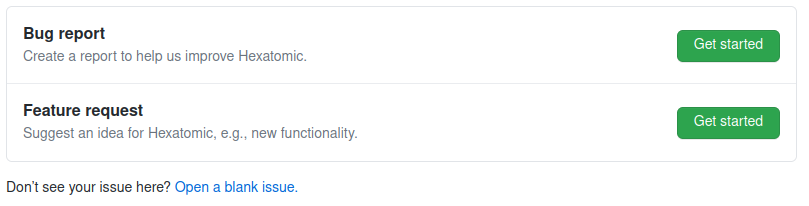
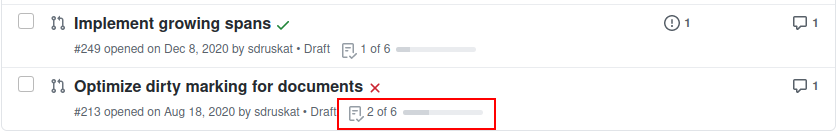

# Template files

Template files can be used to customize the GitHub repository to some extent.
The Hexatomic repository uses two different template types:

1. Issue templates
2. A pull request template

These templates are text files in the `.github/` directory that are formatted with Markdown, and may have a [YAML](https://yaml.org/) frontmatter.
You can learn more about issue templates and pull request templates from the [GitHub documentation](https://docs.github.com/en/communities/using-templates-to-encourage-useful-issues-and-pull-requests/about-issue-and-pull-request-templates).

The templates contain the predefined contents of the initial issue comment, or the initial pull request comment.
They may contain checklists, text sections, bullet lists, etc., that work as "form elements" the user is aksed to complete.

Further instructions for users are included as `<!-- HTML comments -->`.

## Issue templates

You can find the issue templates in `.github/ISSUE_TEMPLATE/`.
GitHub will use the contents of this directory to determine the way that new issues are created.

The Hexatomic repository has two issue templates, one for bug reports ([`.github/ISSUE_TEMPLATE/bug_report.md`]()), and one for feature requests ([`.github/ISSUE_TEMPLATE/feature_request.md`]()).
Therefore, when you create a new issue, you are being asked which type of issue you want to create: a bug report, or a feature request.
The names and descriptions of the options come from the YAML frontmatter of the different issue template files.



On a side note, if there is only one template per template type (issue/pull request), no name and description is needed, and the single file will automatically be used.

Once you choose between issue types, a new issue will be created for you to edit.
The editor will be pre-populated with the contents of the respective Markdown file.
Additionally, the frontmatter of the respective Markdown file determines some other values for the newly created issue, for example

- the name of the template (shown in the issue choice dialogue);
- the description of the template (shown in the issue choice dialogue)
- the title of the newly created issue
- A list of labels that will be assigned to the newly creted issue
- A list of assignees that the newly created issue will be assigned to.

Below is an example for the frontmatter of the bug report template. 
The triple hyphens define a section of frontmatter in YAML.

```yaml
---
name: Bug report
about: Create a report to help us improve Hexatomic.
title: ''
labels: 'bug'
assignees: ''
---
```

This frontmatter, together with the Markdown body text of the template creates a pre-populated new issue as in the following figure.


## Pull request template

The pull request template works similarly to the [issue templates](#issue-templates).
Its main feature is a checklist for the user to complete before the pull request can be reviewed.
The completion progress of the checklist is also reported on the repository page listing all pull requests.

