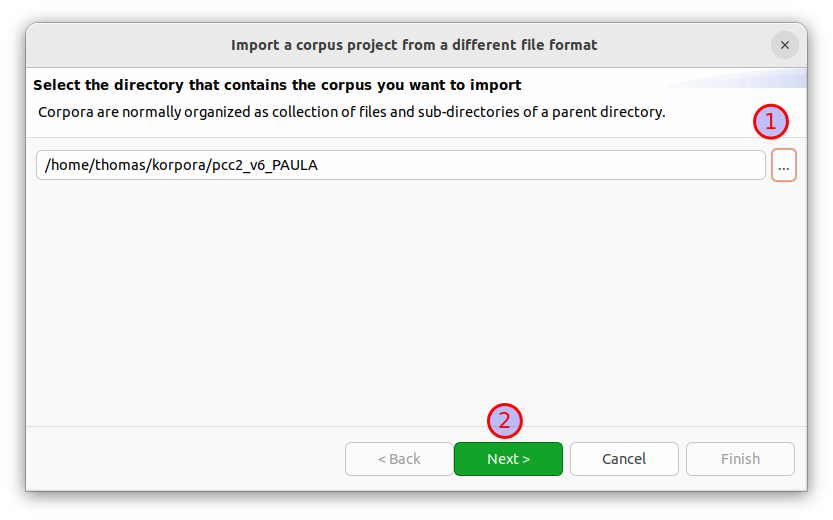
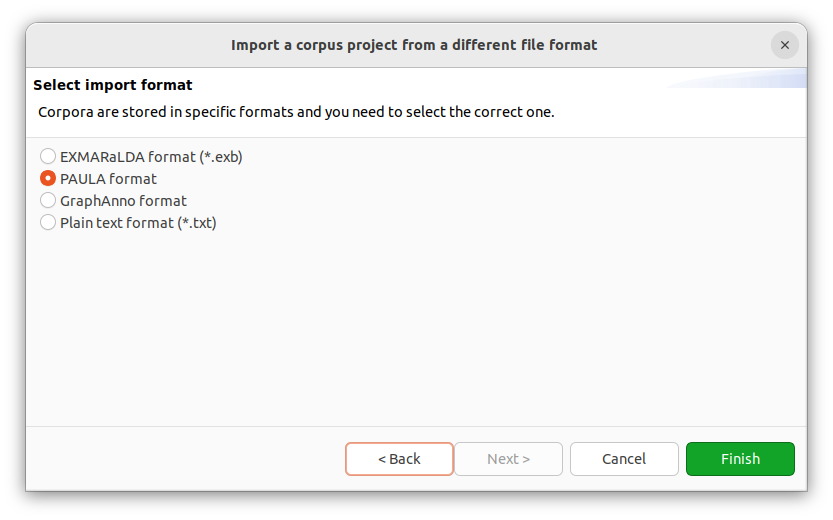
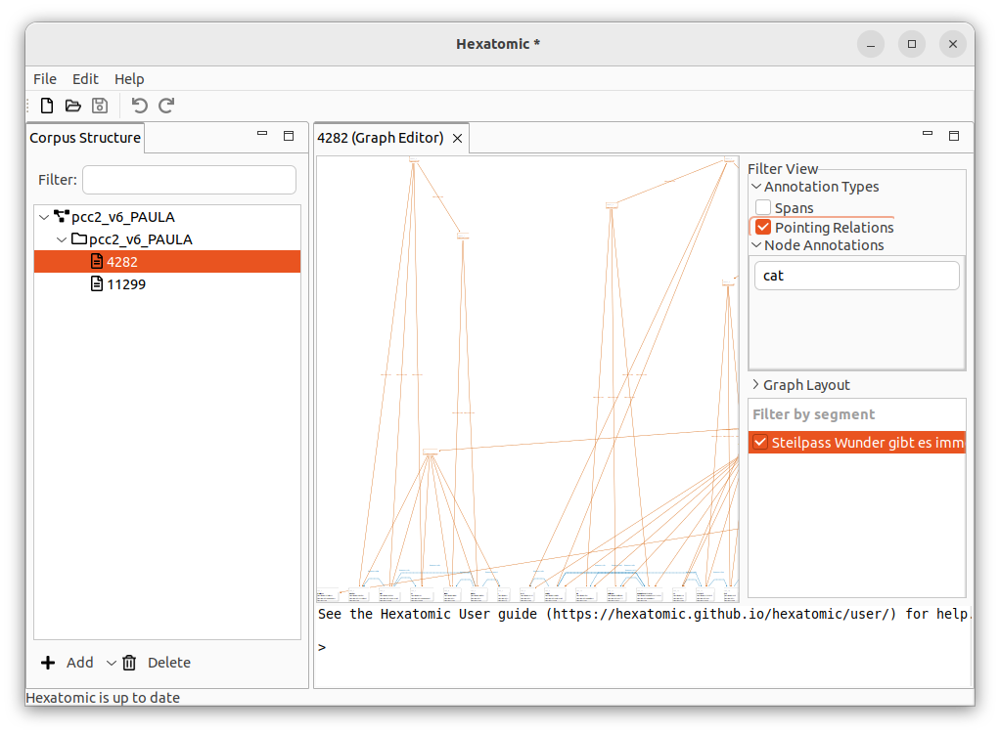
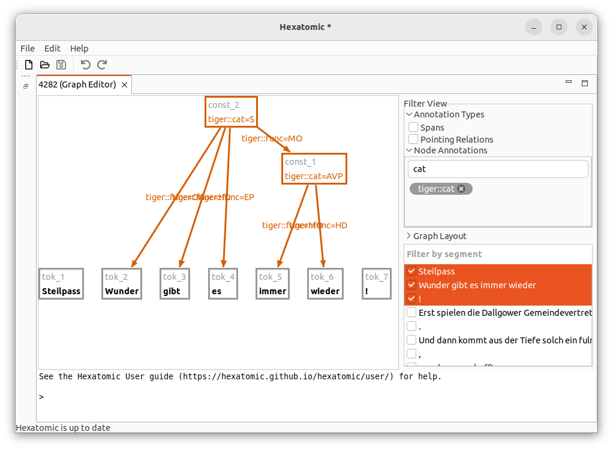
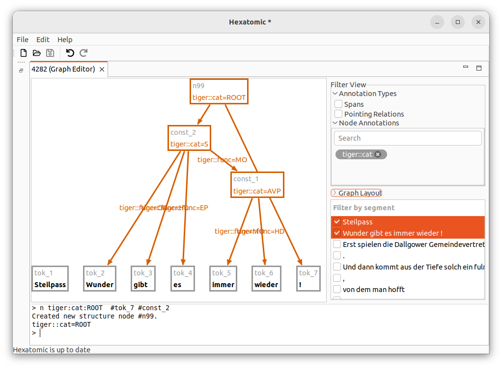

# Import and annotate an example corpus

We will import an example corpus from the [ANNIS demo corpus
page](https://corpus-tools.org/annis/corpora.html), namely the so-called
"pcc2" corpus, a sample from the [Potsdam Commentary Corpus](http://angcl.ling.uni-potsdam.de/resources/pcc.html).
It contains several annotation layers, like constituent trees, dependency trees and annotation for information structure.

1. Go to <https://corpus-tools.org/annis/corpora.html>.
2. [Download](https://corpus-tools.org/corpora/pcc2_PAULA.zip) the corpus named "pcc2" in the PAULA format.
3. Unzip the file to a folder of your choice
4. Choose the *Import* entry in the *File* menu.
5. Click on the button with the *...* caption and navigate to the unzipped `pcc2_v6_PAULA` folder. Then click on *Next*.

6. The importer should correctly identify this corpus as "PAULA format". Click on *Finish* to import the corpus.

7. Expand the corpus structure in the "Corpus Structure" view and right-click on the "4282" document, select "Open with Graph Editor".

8. This shows either the whole document (Linux), or the first segment of the document (Windows). 
We are only interested in the constituent tree for now. Expand "Annotation Types" and "Node annotations" in the [Filter View](../usage/graph-editor/filter.md). Unselect "Pointing Relations" in "Annotation Types". 
Then type `cat` into the "Search" field in "Node Annotations" and click on the `tiger::cat` filter badge. 
Now we can select the segments we are interested in.
Click on the first three segments while holding the <kbd>Ctrl</kbd> key.

9. Add new annotations using the [console](../usage/graph-editor/console.md). To add a root node connecting the trailing token "!" with the sentence constituent node, enter `n tiger:cat:ROOT` in the console. Then double-click on the `tok_7` node and again on the  `const_2` node. This should complete the prompt in the console to `n tiger:cat:ROOT #tok_7 #const_2`. With the cursor active at the end of the prompt, press <kbd>Enter</kbd>. Note that the segmentation changes because we connected the previously separate segments. If the [segmentation does not change automatically](https://github.com/hexatomic/hexatomic/issues/451), hover over the segments in the segmentation view to update them.  

10. Save the project via by clicking on the *File* menu and then *Save Salt Project As...* to persist the changes as a [project](../usage/projects.md).