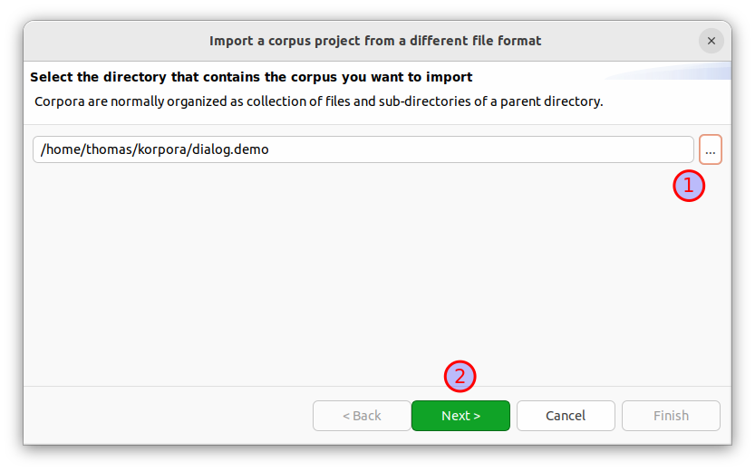
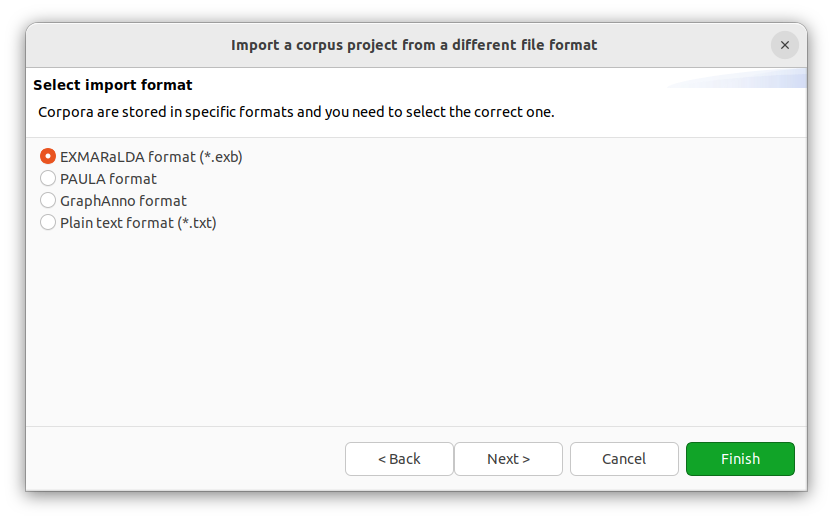
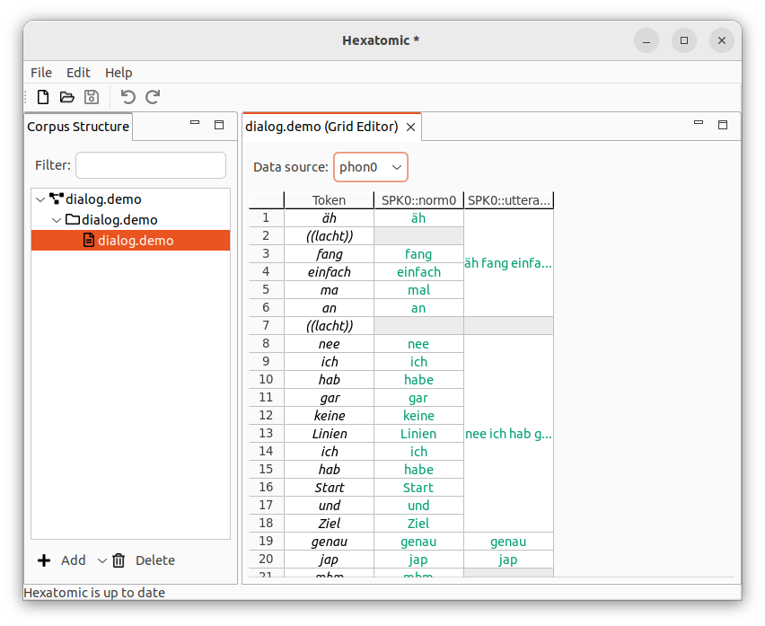

# How to import a corpus from EXMARaLDA

We will import an example corpus from the [ANNIS demo corpus
page](https://corpus-tools.org/annis/corpora.html), the so-called
“dialog.demo” corpus, a sample from the [BeMaTaC corpus](https://www.linguistik.hu-berlin.de/de/institut/professuren/korpuslinguistik/forschung/bematac).

1. Go to <https://corpus-tools.org/annis/corpora.html>.
2. [Download](https://corpus-tools.org/corpora/dialog.demo_EXMARaLDA.zip) the corpus named “dialog.demo” in the EXMARaLDA format.
3. Unzip the file to a folder of your choice
4. The folder will have a structure with the root corpus as folder and a single `.exb` file containing a document. The video file next to it will be linked with the document, but Hexatomic can not yet play video files.
```plain
dialog.demo/
├── dialog.demo.exb
└── dialog.demo.webm
```
5. Choose the *Import* entry in the *File* menu.
6. Click on the button with the *...* caption and navigate to the unzipped `dialog.demo` folder. Then click on *Next*.

7. The importer should correctly identify this corpus as “EXMARALDA format (*.exb)”. Click on *Finish* to import the corpus.

8. Unfold the corpus and in the “Corpus Structure” and right-click on the “dialog.demo” document, select “Open with Grid Editor”.
Choose “phon0” as data source to show the token and span annotations for the first speaker.

9. You can now continue to [work with the imported data in the Grid Editor](../usage/grid-editor/index.html).
