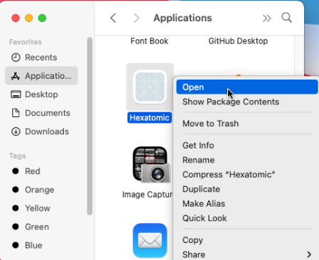

# Hexatomic installation & start

## Download

1. Go to the download site for the latest release of Hexatomic:  
<https://github.com/hexatomic/hexatomic/releases/latest>.
2. Download the `.zip` file for your operating system:
    - **Linux**: Download `hexatomic-<version>-linux.gtk.x86_64.zip`
    - **Mac OS**: Download `hexatomic-<version>-macosx.cocoa.x86_64.zip`
    - **Windows**: Download `hexatomic-<version>-win32.win32.x86_64.zip`
3. On Windows and Linux, extract the downloaded `zip` file to a directory of your choice.[^1]. When you download the file on Mac OS with the Safari Browser, the `zip` file is extracted automatically.

For Linux and Windows, that's it. You can now run Hexatomic.

On macOS, you need to move the Hexatomic application from the "Download" folder to the "Applications" folder by dragging it to "Applications" in the Finder.

## Run Hexatomic

1. Go to the folder into which you have unzipped the Hexatomic download (e.g. "Applications" on macOS).
2. Run Hexatomic by  double-clicking on the launcher file in a file manager.[^cmdrun]

### macOS-specific instructions

When you start Hexatomic for the first time on macOS, use the context menu and choose "Open" from there.

You will be asked if you want to open Hexatomic, although it has not been downloaded from a trusted source.
This dialog appears because we don't have an expensive Apple Developer ID and therefore cannot sign Hexatomic releases with it.
Choose to open Hexatomic anyway. This dialog will be only shown on the first start, and you can open Hexatomic regularly afterwards.

---

[^1]: Some archive extraction software may not work, and Hexatomic may not start. In this case, try [7zip](https://www.7-zip.org/), which should work.

[^cmdrun]: Users with command line experience can also start the launcher file from the command line.
- In **Linux**, the launcher file is simply called `hexatomic` and can be started with `./hexatomic`.  
- In **Windows**, the launcher file is simply called `hexatomic.exe` and can be started with `hexatomic`.  
- For **Mac OS X**, we provide an `.app` file called `hexatomic.app`.
