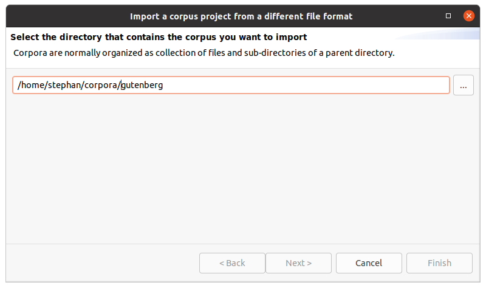

# Creating a corpus from scratch

You can use Hexatomic to build a corpus from the ground up.
All you need to have is the text data that you want to annotate.

## Tutorial

1. Create a directory with the name that your corpus should have.
Avoid special characters and spaces when naming your directory.

2. **[Optional]** Create subdirectories for any subcorpora you want to create.

3. Add plain text files ending in `.txt` that contain the raw text of your corpus.
Create one file for each text that should make up a separate document in the corpus.
Sort the files into the respective subfolders for subcorpora, should you have any.
Make sure to save the text files with the [UTF-8 character encoding](https://en.wikipedia.org/wiki/UTF-8).
If you use Windows, you cannot use the default Notepad.
Use another text editor instead, for example the free and open source [Notepad++](https://notepad-plus-plus.org/),
which uses UTF-8 per default.

A simple corpus structure may, for example, may now look like this:

```bash
my-corpus/
├── document1.txt
└── document2.txt
```

A (slightly) more complex corpus with two subcorpora may now look like this:

```bash
gutenberg/
├── authors_A-M
│   ├── jane_eyre.txt
│   ├── moby_dick.txt
│   ├── sense_and_sensibility.txt
│   └── sherlock_holmes.txt
└── authors_N-Z
    ├── dracula.txt
    ├── frankenstein.txt
    └── time_machine.txt
```

4. Open Hexatomic, and import the newly created main corpus directory (from step 1),
as described in [Importing and exporting corpora](../usage/import-export.md).
The following screenshots show the steps to take for the import of the corpus.
Once the import is finished, you can work with the corpus and annotate the documents as described in [Usage](../usage/).





