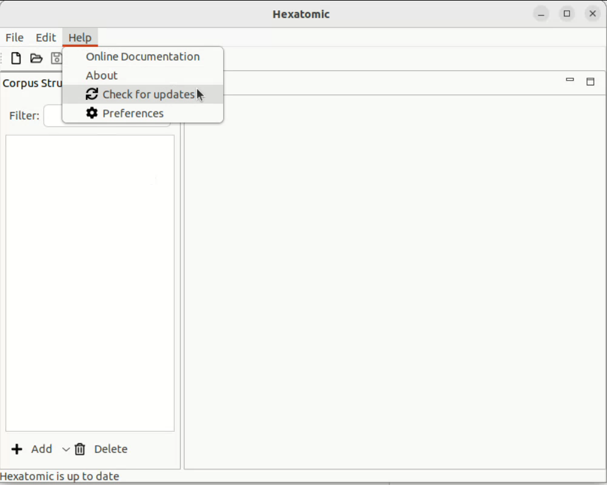

# Update

## Search for Updates

There are two ways to update Hexatomic. You can either update it manually or enable  automatic checks at each startup.

### Manual Updates
1. Click on *Help* in the main menu 
2. Select *Update*

### Auto-updates at startup
1. Click on *Help* in the main menu
2. Select *Preferences*

3. Check the box *Enable automatic update at startup* and confirm with *Ok*.
   If checked Hexatomic will search for updates automatically at each startup.

   
## Perform Updates

2. If there are Updates they will be performed automatically. Otherwise you will be informed that there are no Updates available.
3. After successful installation Hexatomic has to be restarted to apply the changes. You will be asked if you want to restart. If you have unsaved changes save them first and perform the restart manually.

