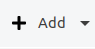
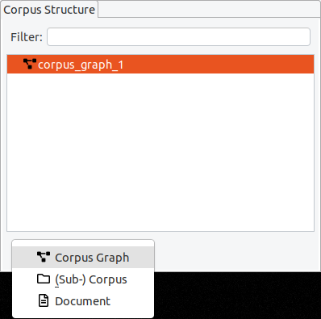

# Editing the corpus structure

Each corpus project can consist of multiple documents which are organized into

- corpus graphs,
- corpora, and
- sub-corpora.

Even in simple projects with only one document, this corpus structure exists and can be used to extend or re-organize existing corpora.
The minimal structure for a corpus with one document is therefore: One corpus graph containing one corpus containing one document.

In Hexatomic, the corpus structure is always visible in the special “Corpus Structure” editor.

## Corpus graphs

Corpora, sub-corpora and documents are organized in a hierarchical structure, the so-called corpus graph.
A project in Hexatomic *can* have more than one corpus graph, but for most projects a single corpus graph is sufficient.
In the special case where you import different corpora from different annotation formats into the same Hexatomic project for merging them, you will need more than one corpus graph.

In an empty project, just click on the “Add“ button to add a new corpus structure.

The default “Add“ button is context-sensitive, and will add elements "intelligently", depending on which type of element is currently selected in the corpus structure.
To explicitly choose the element to add, click on the small arrow on the right side of the button and a drop-down menu with the different options will appear.

If you delete a corpus graph, all of its documents and corpora will also be deleted.
When a (sub-) corpus is deleted, the documents are moved to the parent element.

## Corpora and sub-corpora

Inside a corpus graph, the different corpora and sub-corpora are organized as a hierarchy.
A corpus graph should only contain one top-level corpus, whose name is often used as corpus name when exporting the corpus to a different format.
To add a sub-corpus, select the parent corpus, click on the arrow on the right side of the “Add” button and choose “(Sub-) Corpus”.
You can edit the name of a corpus by double-clicking on its entry and pressing enter when finished.

## Documents

When a corpus is selected, the default action for the "Add" button is to add a new document.
When a document is selected, the "Add" button will create a new sibling document in the same parent corpus.
Documents must have a corpus as a parent and contain the base text and linguistic annotations.
You can move a document from one (sub-) corpus to another by dragging and dropping it.

It is possible to apply a filter, to only show documents whose names contain a certain string.

