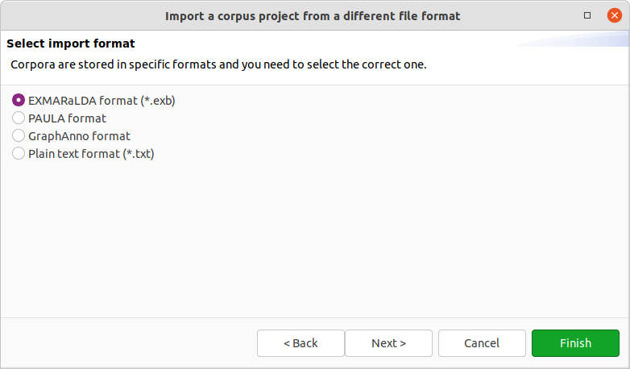
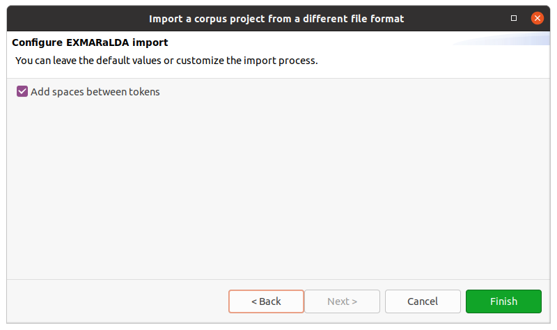

# File format support

Per default, Hexatomic will store its project in its native data format Salt.
You can, however, import corpora from different formats, or export them to another one.

Currently, Hexatomic supports the following additional file formats:

- [PAULA XML](https://github.com/korpling/paula-xml)
- [EXMARaLDA files](https://exmaralda.org)

## Import existing corpora

To import existing corpora, which are not stored in Salt, choose the *Import* entry in the *File* menu.
This will start a wizard, which will guide you through all necessary configuration steps.

First, select the directory that contains the corpus files you want to import.
For most corpus formats, the selected directory name will become the root corpus name, e.g. in the following example this would be `example-corpus`.

Most formats use a single file for each document, but PAULA XML will use a sub-directory containing files for each annotation layer.

After clicking on *Next >* in the wizard, you will see the format selection page.
The wizard will try to auto-detect and pre-select the correct format in the given directory and select it for you.
Make sure the corpus format is selected as expected and *Finish* to import the corpus with the default settings.
Some formats allow various configuration settings, that can be changed by clicking on *Next >* instead.

After clicking on *Finish* the import will start and show the progress.
The wizard will close automatically when the import is finished.
You can also abort the import process by clicking on the red squared stop button right next to the progress bar.

