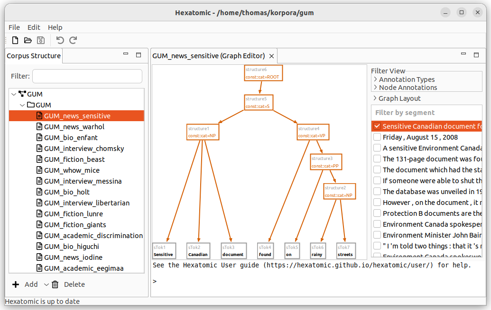

# Graph Editor

The graph editor is for visualizing and annotating annotation graphs.
It provides a general visualization that displays all possible types of annotation in a graph of annotatable elements.

## Filters

On the right-hand side of the interface, you can select which segment of the current document to show in the [graph view](#graph-view).
For large graphs, it can take some time until its layout is calculated.
The checkbox next to the segment indicates if this calculation is finished.
You can select more than one segment to display, by holding the <kbd>Ctrl</kbd> key while clicking on additional segments.
You can also show a whole range of segments by holding the <kbd>Shift</kbd> key and clicking on the last segment of the range you want to select.

To access additional filter options, click and expand a relevant category in the **Filter View** section.

You can choose to display spans and their annotations in the graph, by first expanding **Annotation Types** and the checking the checkbox **Spans**. 
Spans are special nodes to collect a number of tokens and to annotate them all at once.
If you want to learn more about spans, please read the [Salt documentation](http://corpus-tools.org/salt/#documentation).
Similarly, you can show or hide pointing relations between nodes in the graph by using the checkbox **Pointing Relations**.

**Node Annotations** allow you to filter the segments that include annotations of a specific *name*.
Search for an annotation name in the text field, select the matching annotation, and a facet filter will be added.
You can add more than one filter and any node, that contains any of the selected annotation names, will be shown.
Click on the cross marking to delete the annotation name filter again.
If no annotation names are selected, all annotations are shown.

## Graph view

The left-hand side of the graph editor is taken up by the graph view, which displays the nodes and relations in the data model of the current document.

You can navigate the graph view as follows:

- **Zoom in and out** by using the **mouse wheel**.
  - You will zoom in to where your mouse cursor is.
- **Zoom in and out** by using **using the keyboard**.
  - If you press and hold the <kbd>Ctrl</kbd> key, you can zoom in with the <kbd>+</kbd> key and zoom out with the <kbd>-</kbd> key.

- **Move** the area of the graph that is displayed by **using the keyboard**:
  - The <kbd>Arrow keys</kbd> move the area in the respective direction, and <kbd>PgUp</kbd> and <kbd>PgDown</kbd> move it up and down.
  - If you press and hold the <kbd>Shift</kbd> key and then use the arrow or paging keys, you move more quickly.

- **Move** the area of the graph that is displayed by **using the mouse wheel and function keys**:
  - If you hold down <kbd>Shift</kbd> key while moving the mouse wheel, you can scroll *up and down*.
  - If you hold down <kbd>Ctrl</kbd> key while moving the mouse wheel, you can scroll *left and right*.

- You can **center the view** around a specific point in the graph by double-clicking that point.

If you don't like the layout of the graph, you can change it by simply dragging nodes with your mouse.

## Console

On the bottom of the graph editor, there is the console which you can use to actually edit the graph.
How to do this is explained in detail in the next section, [Editing the graph](./console.md).
