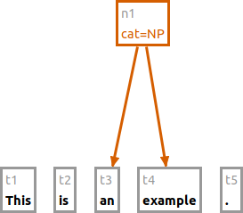
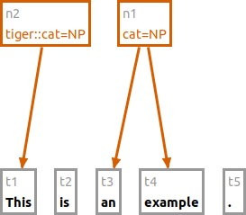
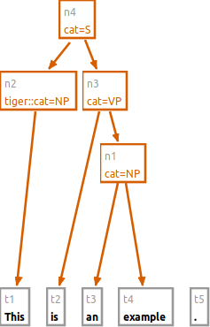
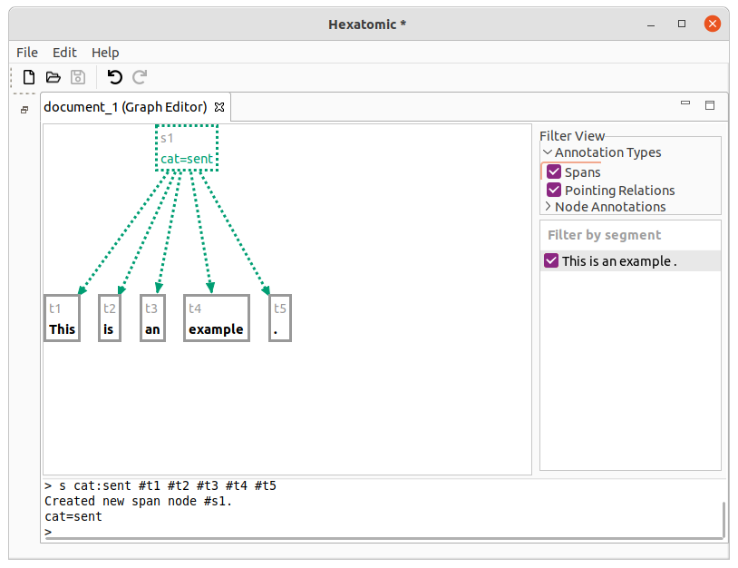
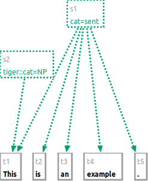
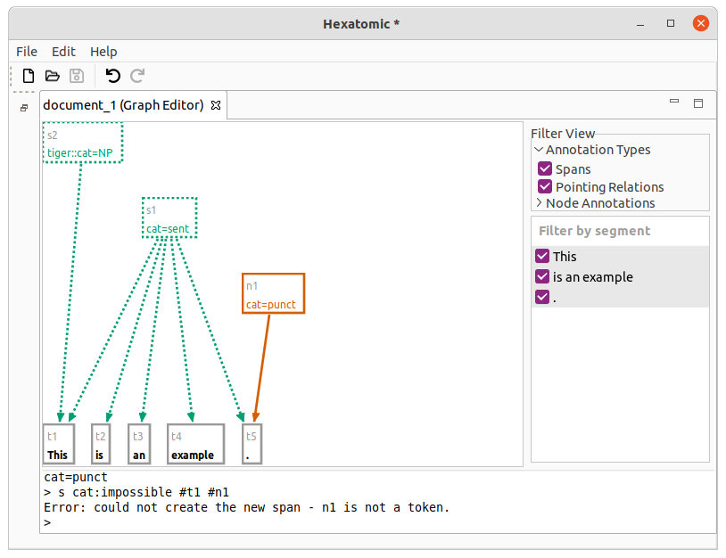
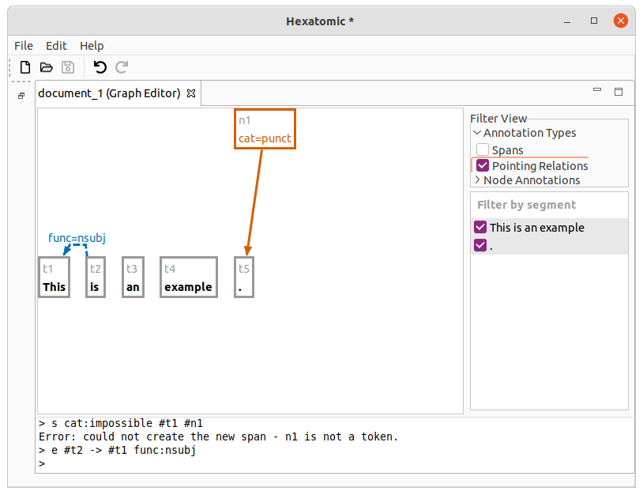
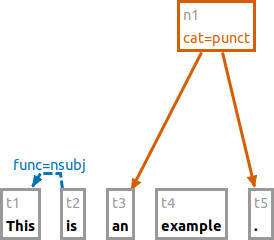
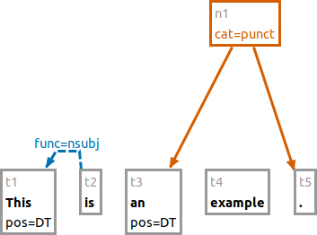

# Editing the graph

The graph editor contains a console, which you can use to manipulate the annotation graph.
You first enter a command by entering it as text behind the so-called prompt `> ` and pressing <kbd>Enter</kbd>.


Commands typically start with its name and a list of arguments. The arguments are specific to each command but can share similar syntax.
Hexatomics command line syntax is similar to the one of [GraphAnno](https://github.com/LBierkandt/graph-anno/blob/master/doc/GraphAnno-Documentation_en.pdf).

Currently, the following commands are supported.

> - [`t`: Tokenize](#tokenize-t)
> - [`tb`/`ta`: Tokenize before /after a token](#tokenize-before-tb-and-after-ta-a-given-token)
> - [`tc`: Change the text of a token](#change-the-text-of-a-token-tc)
> - [`n`: New node](#new-node-n)
> - [`s`: New span](#new-span-s)
> - [`e`: New edge](#new-edge-e)
> - [`a`: Annotate](#annotate-a)
> - [`d`: Delete elements](#delete-elements-d)

## Tokenize: `t`

Tokenize the given argument string and add the tokens to the annotation graph.
String values can be enclosed in quotes, e.g., for punctuation and for tokens that include whitespace.

### Examples

```text
t This is an example "."
```

This command will result in 5 tokens: `[This] [is] [an] [example] [.]`.


If you call `t` again, the new token will be appended to the end.
E.g. calling `t Not .` will result in 7 tokens in total: `[This] [is] [an] [example] [.] [Not] [.]`.
Note that the dot is not escaped with `"` quotation marks in this example, and that `t Not.` would also work.

Other than that, escaping punctuation with quotation marks is required for all non-alphabetical characters, to ensure correct tokenization, such as in `t I "'" m ...`.


## Tokenize before (`tb`) and after (`ta`) a given token

Tokenize the given argument string and add the tokens to the annotation graph before or after a given reference token.

### Examples

Starting with an initial text with the two tokens `[This] [text]` (first one is called "t1" and the second one "t2"),
executing

```text
tb #t2 very simple
```

will append the two new tokens *before* the second token: `[This] [very] [simple] [text]`.
Given the new tokens, calling the following command will insert the two new tokens *after* the first token (`[This] [is] [a] [very] [simple] [text]`).

```text
ta #t1 is a
```

## Change the text of a token: `tc`

Change the text that an existing token covers.

### Examples

Let's start with an initial text with the two tokens `[This] [text]`. The first token is called "t1" and the second one "t2".
You can execute the following command:

```text
tc #t2 example
```

This will change the covered token text from "text" to "example": `[This] [example]`.
All tokens before and after the changed token are not affected.
Only one token can be changed at a time.

#### See also

- [Identifying elements](#identifying-elements)

## New node: `n`

The command `n` will create a new node, and dominance relations between the new node and existing nodes.

Additionally, it can be used to annotate the new node in the same command.

Arguments starting with `#` refer to the node names to which dominance edges are added (e.g. `#someNodeName`).

When the creation was successful, the console will print a message giving the name of the new node and its annotations.

### Examples

Starting with the tokens `[This] [is] [an] [example] [.]`, the following command will group "an example" to a node
with the label "cat=NP".

```text
n cat:NP #t3 #t4
```



The following command creates a new node using the namespace "tiger" for the annotation.

```text
n tiger:cat:NP #t1
```



You can mix nodes and tokens in the `n` command.
Also, the number of dominated nodes is not restricted.

```text
n cat:VP #t2 #n1
n cat:S #n2 #n3
```


#### See also

- [Identifying elements](#identifying-elements)
- [Defining annotations](#defining-annotations)

## New span: `s`

The command `s` will create a new span, and spanning relations between the new span and existing tokens.

Additionally, it can be used to annotate the new span in the same command.

Arguments starting with `#` refer to the token names to which spanning edges are added (e.g. `#someTokenName`).

When the creation was successful, the console will print a message giving the name of the new span and its annotations.

Note that spans can created over tokens only.

### Examples

Starting with the tokens `[This] [is] [an] [example] [.]`, the following command will group the whole sentence to a span
with the label "cat=sent".

```text
s cat:sent #t1 #t2 #t3 #t4 #t5
```



The following command creates a new span using the namespace "tiger" for the annotation.

```text
s tiger:cat:NP #t1
```



You can only use tokens in the `s` command.
Also, the number of spanned nodes is not restricted.

```text
n #t5 cat:punct
s cat:impossible #t1 #n1
```


#### See also

- [Identifying elements](#identifying-elements)
- [Defining annotations](#defining-annotations)

## New edge: `e`

You can add two types of edges to the graph: dominance relations (e.g., for syntax trees) and pointing relations (directed edges without a specific semantic).
Dominance edges are created with the syntax `e #source > #target` where `#source` is a node reference to the source node and `#target` a node reference to the target node.
For pointing relations, use `->` instead of `>`.
This syntax is used to reference edges in general, e.g., when annotating or deleting them.
As with new nodes, initial annotations can be added as arguments: `e #source > #target name:value`.

### Examples

```text
e #t2 -> #t1 func:nsubj
```

This adds a pointing relation between `#t2` and `#t1` with an annotation named "func" and the value "nsubj."



```text
e #n1 > #t3
```
This example adds a dominance relation between the existing nodes.



#### See also

- [Identifying elements](#identifying-elements)
- [Defining annotations](#defining-annotations)


## Annotate: `a`

Adds, updates, or deletes annotations on existing nodes or edges.
Takes as arguments the nodes or edges which should be annotated, and the annotation to add, change, or delete.
You can delete existing annotations by leaving the value in the annotation attribute empty.

### Examples

```text
a pos:DT #t1 #t3
```

Sets the annotation "pos" to the value "DT" for both nodes "t1" and "t3".



```text
a pos: #t1
```

Deletes the "pos" annotation for the "t1" node.


```text
a func_alt:nominal_subject #t2 -> #t1
```

Adds the "func_alt" annotation to the existing pointing relation between "t2" and "t1".

#### See also

- [Identifying elements](#identifying-elements)
- [Defining annotations](#defining-annotations)

## Delete elements: `d`

Deletes any node or edge of the graph.
Give the elements to delete as an argument.

### Examples

```text
d #t4 #t5
```

Deletes nodes "t4" and "t5".

```text
d #t2 -> #t1
```

Deletes the pointing relation between "t2" and "t1".

#### See also

- [Identifying elements](#identifying-elements)


## Identifying elements

Elements in the graph are identified by the identifier on the node/edge in the graph. In the example below, the tokens have
the identifiers `sTok1`, `sTok2`, `sTok3`, and `t4`. 

Note that identifiers for the same type of element may look different within one and the same document (as in `sTok1` and `t4`).


## Defining annotations

Annotation arguments have the form `name:value` or `namespace:name:value`.

This is true both for defining new annotations (`namespace` is optional), and for addressing existing annotations (`namespace` is **required**).
