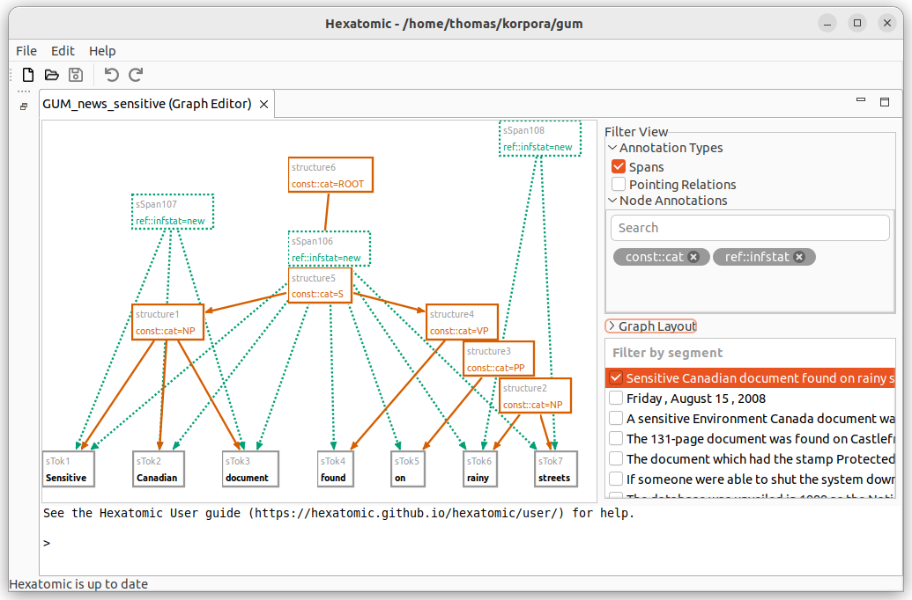

# Filter visible annotations

To access additional filter options, click and expand a relevant category in the **Filter View** section.

You can choose to display spans and their annotations in the graph, by first expanding **Annotation Types** and the checking the checkbox **Spans**. 
Spans are special nodes to collect a number of tokens and to annotate them all at once.
If you want to learn more about spans, please read the [Salt documentation](http://corpus-tools.org/salt/#documentation).
Similarly, you can show or hide pointing relations between nodes in the graph by using the checkbox **Pointing Relations**.

**Node Annotations** allows you to filter the segments that include annotations of a specific *name*.
To add a filter criterion (also called a "facet"), search for an annotation name in the text field and select the matching annotation.
This creates a box with the annotation name of the applied filter.
You can add more than one filter and any node, that contains any of the selected annotation names, will be shown.
Click on the close button to delete the annotation name filter again.
If you select no annotation names, all annotations will be visible.
