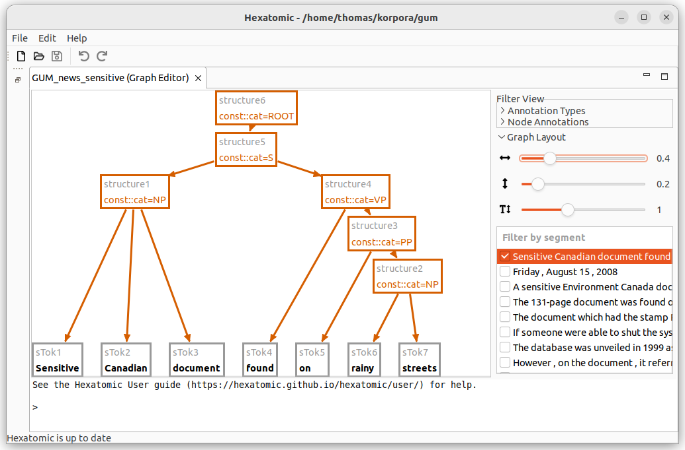
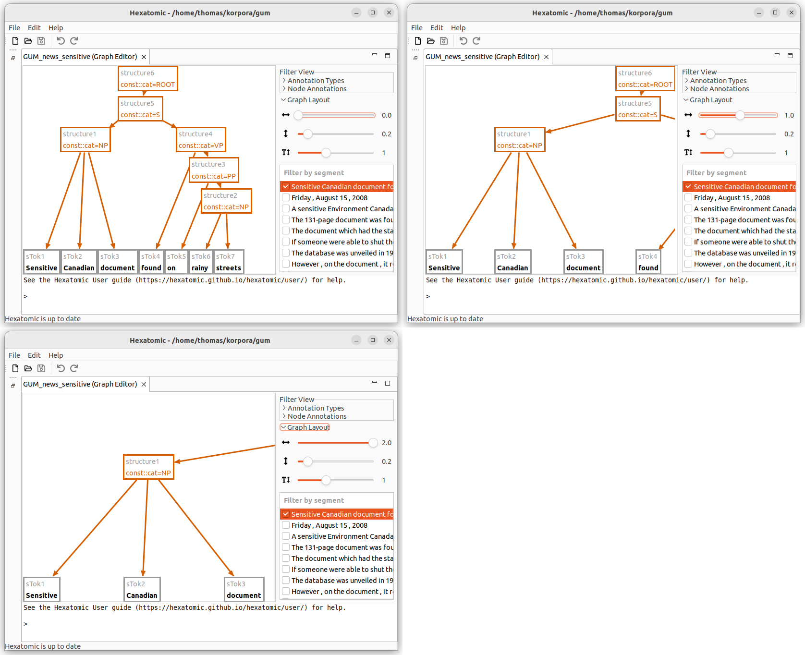
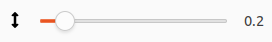
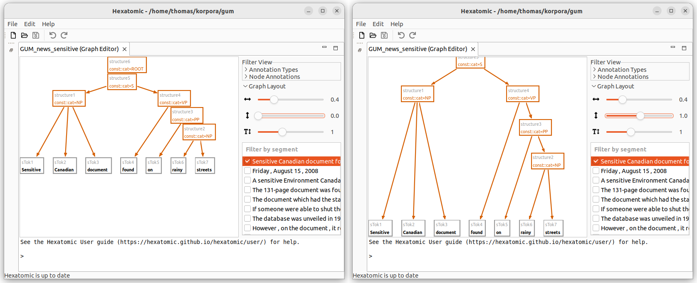
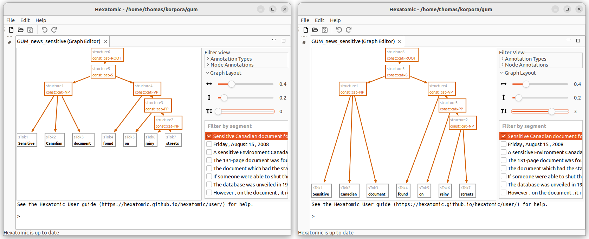

# Change layout parameters

Depending on the visible annotations and the specific graph, the default visualization of the graph might be cluttered.
The graph editor will try to arrange the nodes using a default layout algorithm.
You can adjust the layout parameters by expanding the "Graph Layout" section.

## Horizontal margin between tokens

This parameter changes the horizontal space between the tokens at the bottom of the graph.
If the space is increased, this indirectly affects the space between other nodes, too.

This parameter is measured in "multiples of the average token width".
So for \"0\" there is no margin, for "1" the margin has the same width as the average token node, and for "2" the margin is twice as high as the average token node width.

## Vertical margin between nodes

This parameter configures the vertical margin between *all* nodes.

This is measured in "multiples of the node height".
So for "0" there is no margin, for "1" the margin has the same height as the node.

## Vertical margin between tokens and non-tokens

Tokens are grouped horizontally at the bottom of the graph visualization, i.e., in the bottom "row".
To allow space for pointing relations, you can add a margin between the token "row" and the annotation nodes in the "row" just above it.
This margin is in addition to the [vertical margin between nodes](#vertical-margin-between-nodes).

A margin of "1" means there is one empty level added between the token "row" and the annotation node "row" above it, an offset of "0"
means there is no additional space except for the regular vertical margin.

