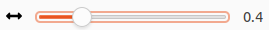

# Change layout parameters

Depending on the shown annotations and the specific graph, the default visualization of the graph might get cluttered.
The graph editor will try to arrange the nodes using a default layout algorithm, which parameters you can adjust by expanding the "Graph Layout" section.

## Horizontal margin between token

There is some horizontal space between the token at the bottom of the graph.
If the space is increased, this indirectly affects the space between other nodes, too.

This is measured in "times of the average token width".
So for \"0\" there is no margin, for "1" the margin has  the same width as the average token node, and for "2" the margin is twice as high as the average token node width.

## Vertical margin between nodes

Configures the vertical margin between *all* nodes.

This is measure in "times of the node height".
So for "0" there is no margin, for "1" the margin has the same height as the node.

## Vertical margin between token and non-token

Token are grouped in the lowest rank (at the bottom)
To allow space for pointing relations, you can add a margin between the token row and the lowest annotation nodes.
This margin is in addition to the [vertical margin between nodes](#vertical-margin-between-nodes).

A margin of "1" means there is one level left empty, an offset of "0"
means there is no additional space except for the regular vertical margin.

