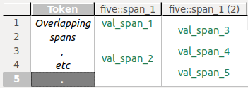
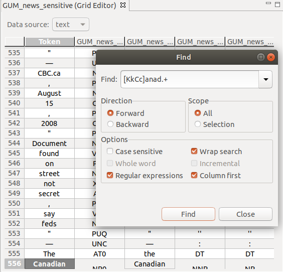

# Grid Editor

The grid editor is for annotating tokens and spans.

Tokens are the smallest countable units in a data source.
Spans are units that span tokens.
To learn more about how Hexatomic's data model - Salt - defines these units, please refer to the [Salt documentation](https://corpus-tools.org/salt/#documentation).

<a name="screenshot"/>

## Data source selection

A corpus document may contain more than one data source (text, audio, video), and their corresponding annotations.
The grid editor displays one of these data sources at a time.

On the upper hand side of the grid editor interface, there is a dropdown menu to select the data source which should be displayed.
If a document contains only a single data source, it is automatically selected.

## Rows, columns, and cells

**Rows** in the grid contain a single token, its annotations, and the annotations on spans that overlap this token. *A token* in this case is the section of the data source the token covers. Depending on the type of data source and the resolution of the tokenization, this may be a word, a morpheme, a phoneme, a section of an audio or video source, etc.

**Columns** in the grid contain all values of a single qualified annotation in this document, that is, a unique combination of `namespace` and `name` of an annotation. 
Additionally, the tokens in a document - or rather, the segment of the document text they represent - are displayed in separate columns preceding any annotation columns.

Note that overlapping spans which are annotated with the same qualified annotation cannot be visualized within the same column.
Instead, the annotation values are spread over more than one adjacent columns, whose headers are then suffixed with the count of existing columns for that qualified annotation.

> *Example*  
> One span (S1) covers the first token in a data source, another one (S2) covers the first and second token.
> Both spans are annotated with values for an annotation `five::span_1`.
> Obviously, the overlap of both spans (both include the first token) cannot be visualized in a single column.
> Instead, *S1*'s annotation value `val_span_1` will be displayed in one column with the header **five::span_1**, *S2*'s annotation value `val_span_3` in another column with the header **five::span_1 (2)**.  
>
> 

**Merged cells** represent annotations on spans that cover more than one token.
You can see this in the last grid column in the [screenshot](#screenshot) above.

To distinguish between the different types of content diplayed in the grid cells, they are styled differently:

- *Token text* is displayed in italics.
- *Token annotations* are displayed in a black font.
- *Span annotations* are displayed in a green font.

## Navigation and selection

The grid can be scrolled with the mouse using the scrollbars.
If you have a mouse wheel, it will scroll horizontally.
If you press <kbd>Shift</kbd> while using the mouse wheel, the grid will scroll vertically.

Alternatively, you can navigate the grid by selecting a cell and using the arrow keys to navigate.
Pressing <kbd>Home</kbd> will jump to the first column, <kbd>End</kbd> will jump to the last column.
<kbd>PageUp</kbd> and <kbd>PageDown</kbd> will jump a page up or down, a page being approximately the number of rows that fit the screen.

You can select whole rows or columns by clicking on the respective header.
When you select a cell, press and hold <kbd>Shift</kbd> and click on another cell, the region between these two cells will be selected.
This also works for headers, where all rows or columns between the two selected header cells will be selected.

Selecting non-adjacent cells, rows, or columns works by pressing and holding <kbd>Ctrl</kbd> while clicking the items to select.

## Text search

You can search the grid using free text or regular expressions, with a number of options, e.g., search in columns first.

To bring up the search window, press <kbd>Ctrl</kbd> + <kbd>F</kbd>.

## Display options

### Freezing grid sections

You can freeze a section of the grid, so that it it remains visible while you scroll.
This comes in handy for example when you have a large grid and want to keep the token column visible at all times.

To freeze a specific section, select the last cell, row or column that should remain visible, and press <kbd>Shift</kbd> + <kbd>Alt</kbd> + <kbd>F</kbd>.
To unfreeze the grid, press <kbd>Shift</kbd> + <kbd>Alt</kbd> + <kbd>F</kbd> again.

Column and row freezing is also available from a popup menu in row and column headers, where you can (re-) set the row or column freeze, or toggle the general freeze state.
The popup menu is opened by right-clicking the row or column header.

### Hiding columns

You can hide columns by selecting one or more columns, and clicking **Hide column(s)** in the popup menu, available on right-click in any of the selected column headers.
To show columns again, click the option **Show all columns** in the same popup menu.

### Auto-resizing rows and columns

You can auto-resize rows columns, so that the row is high/column is wide enough to show all cell contents and the header content completely.
To do so, simply select one or more rows or columns and click **Auto-resize row(s)** or **Auto-resize column(s)** in the popup menu, available on right-click in any of the selected headers.

### Moving columns

You can move columns to another position in the grid by clicking on and holding the header of a column, and dragging it to its new position.

## Export to Excel

If, for whatever reason, you want to export the grid to a file in the Excel `.xls` format, you can do so.
Press <kbd>Ctrl</kbd> + <kbd>E</kbd>. This brings up a dialog for saving the file.

Note that exporting to an Excel spreadsheet will lose the actual data model.
Only the string values of annotations, the headers, and the token texts will be exported.
Additionally, merged cells will be separated.