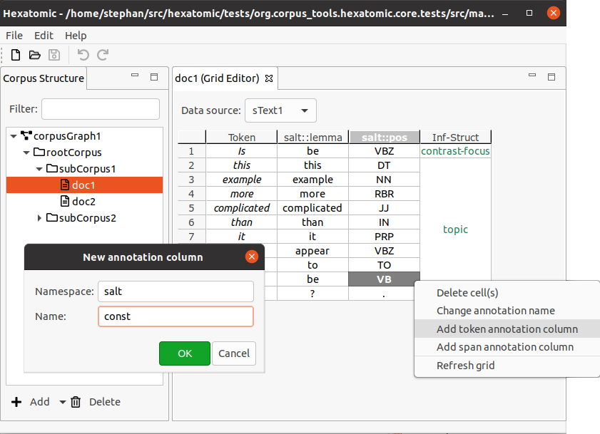

# Editing annotation columns

## Adding annotation columns

Annotation columns can be created for either span annotations or token annotations.
Note that for token annotations, there can only be one column for any qualified annotation name.
You can create a new column for annotations by using the editor's popup menu:

Right-click on a cell or column header to bring up the popup menu, then click **Add token annotation column** or **Add span annotation column** in the popup menu. This will open an editor dialog where you can set the namespace and name for the annotations in the column.

To change the annotations, confirm by clicking **OK**.
You can cancel the creation of the new column by clicking **Cancel** or closing the dialog.
The new column will be created to the right of the column on which you right-clicked for the popup menu.

You can also create new annotations columns by using a keyboard shortcut:

- To create a new *token* annotation columns, press the shortcut <kbd>Shift</kbd> + <kbd>Alt</kbd> + <kbd>T</kbd>.
- To create a new *span* annotation columns, press the shortcut <kbd>Shift</kbd> + <kbd>Alt</kbd> + <kbd>S</kbd>.

Again, use the dialog to specify the annotation namespace and name for the column. The new column will be added as the last column.

## Deleting annotation columns

Columns are not part of Hexatomic's data model, Salt.
Annotation columns without any annotation values in them will therefore be deleted when you [refresh the editor manually](index.md#manual-refresh), or when the project is closed, or another document is opened.
For more information, read the [section about columns](index.md#rows-columns-and-cells).
