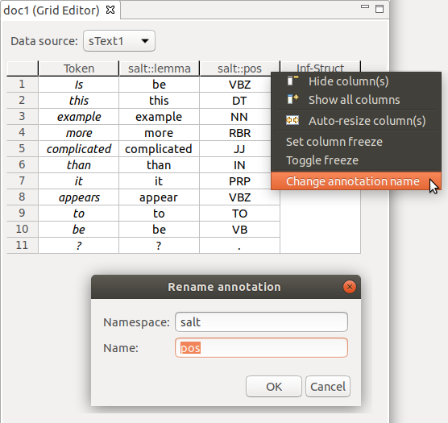

# Editing annotation names

You can change the qualified name of annotations.
Qualified annotation names consist of a namespace and a name.
The column headers in the grid display the current qualified annotation name.

If the column header label includes a double colon `::`, the qualified name consists of a namespace and a name.

If the label does *not* include a double colon `::`, the qualified annotation name consists only of a name.
In this case, you can add a namespace.

If the label does *end* with a double colon `::`, the qualified annotation name consists only of a namespace.
In this case, you can add a name.

## Changing annotation names

You can change annotation names either for all cells in one column, or only for selected cells from one or more columns.

- To change the qualified annotation name for *all cells in a column*, right-click the respective column header to bring up the popup menu.
In the popup menu, click **Change annotation name**.

- To change the qualified annotation name for *one or more specific cells*, select the cells you want to change the annotation name for.
It doesn't matter if all selected cells are in the same column, or if you select cells from different annotation columns.
Right-click the anywhere in the body of the table (i.e., not on a row or column header) to bring up the popup menu.
In the popup menu, click **Change annotation name**.

This will open an editor dialog where you can set the namespace and name for the annotations in the column.

To change the annotations, confirm by clicking **OK**.

You can cancel the change by clicking **Cancel** or closing the dialog.

