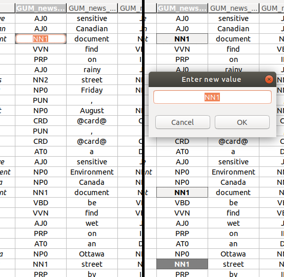

# Editing annotation values

## Editing a single annotation value

To edit a single annotation value, you have to activate the *single cell editor*.
The left-hand side of the screenshot above shows an activated single cell editor.

There are several ways to activate a single cell editor:

A. Double-click on the cell you want to edit.  
B. Press the <kbd>Space</kbd> key.  
C. Just start typing the new annotation value.

## Editing multiple annotation values at once

You can edit multiple values at once.
To do so, select more than one cell (see [*Navigation and selection*](index.html#navigation-and-selection)), and press <kbd>Space</kbd>.
This will bring up a *multi-cell editor window* where you can edit the value of all selected annotations.
The right-hand side of the screenshot above shows three selected cells, and the multi-cell editor window to change their values.

## Adding or changing values

You can add annotation values to empty cells, or change existing ones.

## Adding or changing a single value

In the *single cell editor*, type in the new annotation value and press <kbd>Enter</kbd> to commit the new value.

You can cancel the edit by pressing <kbd>Esc</kbd>.
The cell value will remain the same as before you started editing it.

## Adding or changing multiple values at once

In the *multi-cell editor window*, enter the new value for all selected cells, and commit it by clicking **OK**, or pressing <kbd>Enter</kbd>.

As with the single cell editor, you can cancel the edit by pressing <kbd>Esc</kbd>, or by clicking **Cancel**.

You can also do both adding and changing at once.
If you have selected a mixture of empty cells and ones with existing annotation values, the new value you commit in the *multi-cell editor window* will be set to all cells alike.

## Creating a new span and adding an annotation value

You can create new spans in existing span columns and add annotation values for them:

1. Select the empty cells in a span column you want to annotate as a span.
2. Press <kbd>Alt</kbd>+<kbd>S</kbd> *or* right-click with the mouse and select <strong>Create new span</strong> from the context menu.
This will create a new span cell, and open its *single cell editor*.
3. Type in the new annotation value and press <kbd>Enter</kbd> to commit the new value.

Note that it is possible to create two types of spans:

- *Continuous spans* cover a set of tokens without any gaps between them.
- *Discontinuous spans* cover a set of tokens with gaps between them.
In a document with five tokens (`token 1` to `token 5`), a single span can cover `token 2`, `token 3` and `token 5`. 
Although the span does *not* cover the token between `3` and `5`, `token 4`, and has a "gap", it is still only a single span, and can only have one value for any annotation.

An example of the different span types is shown in the figure below.

## Splitting and merging spans

You can split spans, and merge spans that are in the same annotation column.

### Splitting spans

You can split spans that span over more than one token, and therefore cover multiple grid cells within one annotation column:

1. Select the span cell that you want to split into single-cell spans.
2. Right-click on the span cell, and select **Split span** from the contect menu.

The span will be split into single-cell spans with the same annotation value as the original multi-cell span.
Each of these new spans covers exactly one token.

### Merging spans

You can merge spans that are in the same annotation column and have the same annotation value:

1. Select all spans that you want to merge. These may be discontinuous.
2. Right-click on one of the selected spans, and select **Merge spans** from the context menu.

The spans will be merged into a single span, that may now cover multiple grid cells.
The span will all have the same annotation value as the original single-cell spans.

