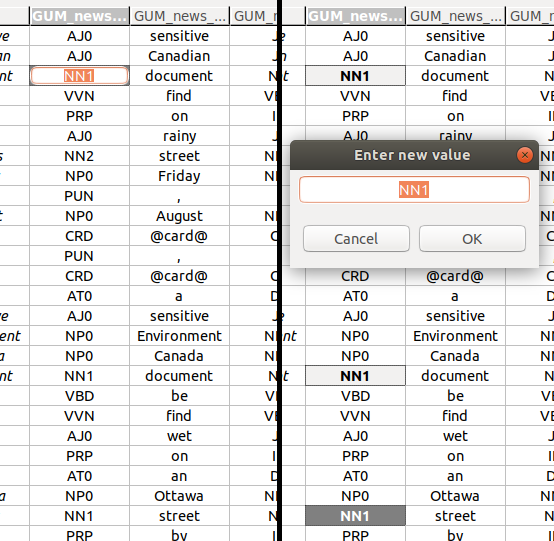
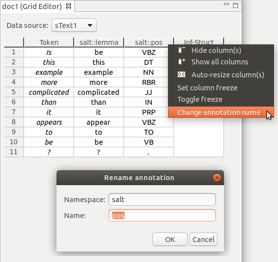

# Editing the grid

## Editing annotation values

### Editing a single annotation value

To edit a single annotation value, you have to activate the *single cell editor*.
The left-hand side of the screenshot above shows an activated single cell editor.

There are several ways to activate a single cell editor:

A. Double-click on the cell you want to edit.  
B. Press the <kbd>Space</kbd> key.  
C. Just start typing the new annotation value.

### Editing multiple annotation values at once

You can edit multiple values at once.
To do so, select more than one cell (see [*Navigation and selection*](index.html#navigation-and-selection)), and press <kbd>Space</kbd>.
This will bring up a *multi-cell editor window* where you can edit the value of all selected annotations.
The right-hand side of the screenshot above shows three selected cells, and the multi-cell editor window to change their values.

### Adding or changing values

You can add annotation values to empty cells, or change existing ones.

### Adding or changing a single value

In the *single cell editor*, type in the new annotation value and press <kbd>Enter</kbd> to commit the new value.

You can cancel the edit by pressing <kbd>Esc</kbd>.
The cell value will remain the same as before you started editing it.

### Adding or changing multiple values at once

In the *multi-cell editor window*, enter the new value for all selected cells, and commit it by clicking **OK**, or pressing <kbd>Enter</kbd>.

As with the single cell editor, you can cancel the edit by pressing <kbd>Esc</kbd>, or by clicking **Cancel**.

You can also do both adding and changing at once.
If you have selected a mixture of empty cells and ones with existing annotation values, the new value you commit in the *multi-cell editor window* will be set to all cells alike.

## Editing annotation names

You can change the qualified name of annotations.
Qualified annotation names consist of a namespace and a name.
The column headers in the grid display the current qualified annotation name.

If the column header label includes a double colon `::`, the qualified name consists of a namespace and a name.

If the label does *not* include a double colon `::`, the qualified annotation name consists only of a name.
In this case, you can add a namespace.

If the label does *end* with a double colon `::`, the qualified annotation name consists only of a namespace.
In this case, you can add a name.

### Changing annotation names

You can change annotation names either for all cells in one column, or only for selected cells frmo one or more columns.

- To change the qualified annotation name for *all cells in a column*, right-click the respective column header to bring up the popup menu.
In the popup menu, click **Change annotation name**.

- To change the qualified annotation name for *one or more specific cells*, select the cells you want to change the annotation name for.
It doesn't matter if all selected cells are in the same column, or if you select cells from different annotation columns.
Right-click the anywhere in the body of the table (i.e., not on a row or column header) to bring up the popup menu.
In the popup menu, click **Change annotation name**.

This will open an editor dialog where you can set the namespace and name for the annotations in the column.

To change the annotations, confirm by clicking **OK**.

You can cancel the change by clicking **Cancel** or closing the dialog.

## Deleting annotations in the grid

You can delete annotations in two different ways:

1. Set an empty annotation value in one or more cells. This works regardless of whether you edit a single cell, or multiple cells at once.
2. Select one or more annotation cells, and then  
   A. either press the <kbd>Del</kbd> key, or  
   B. right-click with the mouse and select **Delete cell(s)** from the context menu.
   This menu item will only be available when deleting the selected cells is possible.

After you have deleted one or more annotations, one or more spans could be left without any annotations.
In this case, these spans will also be deleted.