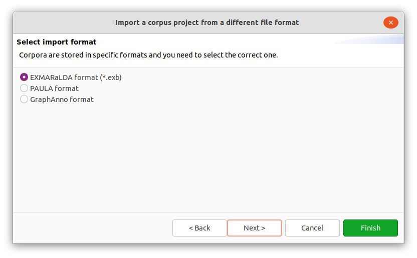
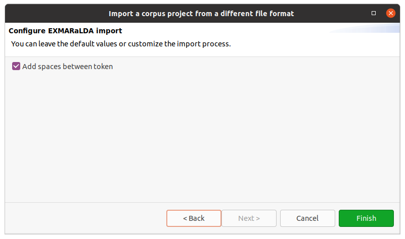

# Importing and exporting corpora

Per default, Hexatomic will store its project in its native data format Salt.
You can, however, import and export corpora from and to different formats.

## Supported file formats

Currently, Hexatomic supports the following external file formats:

- [PAULA XML](https://github.com/korpling/paula-xml)
- [EXMARaLDA *.exb files](https://exmaralda.org)
- [GraphAnno](https://linktype.iaa.uni-jena.de/?nav=graph-anno) (import only)
- Plain text *.txt files (import only)

## Import an existing corpus

To import existing corpora, which are not stored in Salt, choose the *Import* entry in the *File* menu.
This will start a wizard, which will guide you through all necessary import steps.

First, select the directory that contains the corpus files you want to import.
For most corpus formats, the selected directory name will become the root corpus name.
E.g., in the following example this would be `example-corpus`.

Most formats use a single file for each document, with the exception of PAULA XML, which uses a sub-directory containing files for each annotation layer.

After clicking on *Next >* in the wizard, you will see the format selection page.
The wizard will try to auto-detect and preselect the correct format in the given directory and select it for you.
Make sure Hexatomic selected the correct corpus format and press *Finish* to import the corpus with the default settings.
Some formats allow various configuration settings, that can be changed by clicking on *Next >* instead.

After clicking on *Finish* the import will start and show the progress.
The wizard will close automatically after the import process finishes.
You can also abort the import process by clicking on the red square *stop* button right next to the progress bar.

## Export to a different format

Exporting a corpus project is similar to importing one.
You select *Export* from the *File* menu, select an output path and the output format and finish the wizard.
The output path should not contain the root corpus name, since this will be appended automatically.
A project must be saved to disk and must not have any unsaved changes before you can export it.
