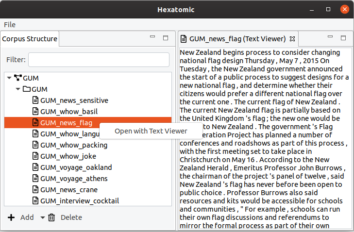

# Opening an editor

To open an editor for a document of the corpus, first select the corpus in the "Corpus Structure" editor on the left.
Then, use the right mouse button to open the context menu for the selected document and click "Show Text".
This will open a new view where the text of the document is displayed.

