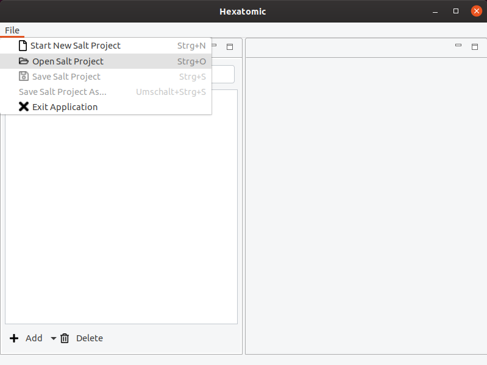

# Working with projects

Hexatomic works on a single Salt project at any one time.
A project consists of a directory containing a project file (`saltProject.salt`) and a number of sub-directories containing the Salt document files.

To open a project in Hexatomic, click on *File* in the main menu and select the option *Open Salt Project*.
A new file dialog window will come up.
Choose the folder containing the project file you want to open, and open it.

After opening a Salt project, you can select *Save Salt Project*, which will write out the Salt XML files into the same
folder as they have been loaded from or *Save Salt Project As...*  to select a different location.
You can see the currently loaded Salt project path in the Window title.
If there are unsaved changes, a *\** will be appended to the title.

To start a new and empty project in the same application window, choose *Start New Salt Project*.
If an action would discard unsaved changes, you can cancel it.