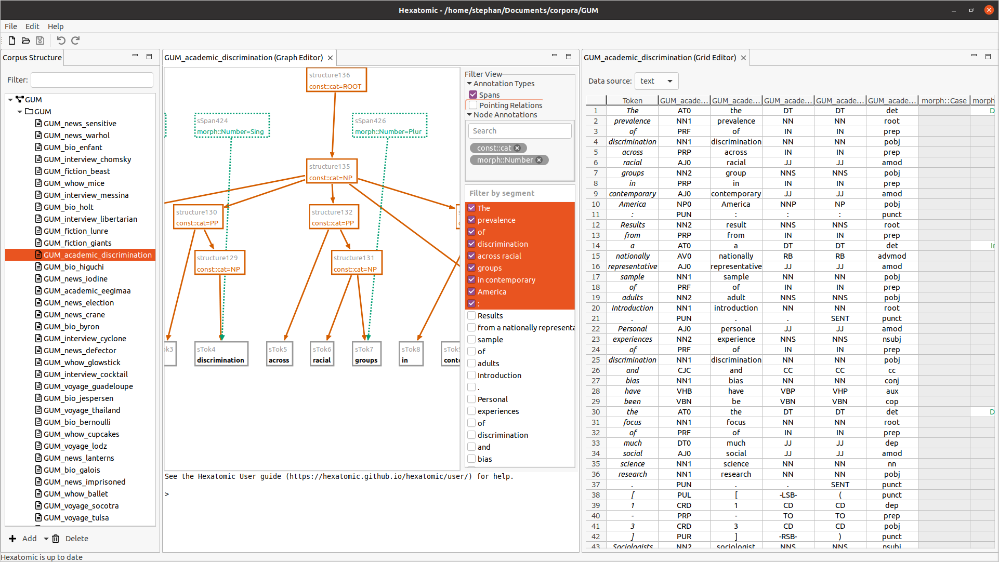

**THOMAS** FYI
Paper should include:
- A list of the authors of the software and their affiliations, using the correct format (see the example below).
- A summary describing the high-level functionality and purpose of the software for a diverse, non-specialist audience.
- A Statement of need section that clearly illustrates the research purpose of the software and places it in the context of related work.
- A list of key references, including to other software addressing related needs. Note that the references should include full names of venues, e.g., journals and conferences, not abbreviations only understood in the context of a specific discipline.
- Mention (if applicable) a representative set of past or ongoing research projects using the software and recent scholarly publications enabled by it.
- Acknowledgement of any financial support.

# Summary

Linguistic research aims to understand how languages work.
This includes finding regularities, understanding language use and/or production in a specific context, and other linguistic research topics.
The data for this research are language artifacts, e.g., recordings or transcriptions of spoken language and records of written language, that are often collected in *corpora*.
In order to analyze languages through these corpora, linguists apply different methods.
Some of these methods are computational and include *automated annotation* of corpora through natural language processing, or gathering statistical insights into corpora through machine learning.
Other methods are computer-aided, and include *manual annotation* of corpora across multiple annotation *layers*.
Linguistic phenomena often occur on different aspects of language, e.g. morphology, part-of-speech, lemmatization, constituent and dependency syntax, entities, coreference, discourse and information structure.
For a deep analysis and understanding of language data it is necessary to include annotation layers for these different aspects in a single multi-layer corpus.
These annotations often have to be made manually, as linguists' insights into specific language features often surpass the generalized models used in machine learning. Additionally, for languages with fewer speakers such as those investigated in linguistic typology and language documentation projects, machine learning models may not exist or there may just not be enough language data for training model.

*Hexatomic* is an extensible platform for multi-layer linguistic annotation of corpora. 
It is available for Linux, MacOS and Windows systems.
While it mainly targets manual annotation methods, it can be extended for automated annotation. 
*Hexatomic* merges previous architectural [@atomic] and functional [@graphanno] prototypes for such a platform.
It uses a versatile graph-based model for linguistic data and includes converters between this model and different linguistic input and output formats [@pepper], 
to enable reuse and enrichment of existing corpora.
The data model and the conversion framework, as well as the widely used corpus query and analysis platform ANNIS [@annis], 
are part of the corpus-tools.org family of linguistic software [@corpustools], that *Hexatomic* completes.

*Hexatomic* enables users to build new corpora from scratch, 
or import existing corpora.
Corpus projects allow flexible organization of corpora, sub-corpora and documents by storing them as nodes in a corpus graph.
This way, many documents across many corpora can be maintained within a single project.
These documents can then be annotated on arbitrary layers using different editor plugins.
Hexatomic 1.0.1 includes a spreadsheet-like editor for token and span-based annotations,
and a graph editor for arbitrary annotation layers.
Additional annotation editors can be added to the platform as plugins,
e.g., to perform bespoke, project-specific annotation tasks.
Multiple editors can be used to simultaneously annotate the same data \autoref{fig:hexatomic}, and any changes that are made update any editors currently showing the same elements, e.g., tokens.
Annotation layers can also be filtered dynamically or manually for better usability.

*Hexatomic* comes with extensive user and developer/maintainer documentation, 
and can be automatically updated at runtime.
The platform is built on the extensible Eclipse RCP platform for Java.

# Statement of need

While there is a wide variety of corpus annotation tools available,
most are "specialized single-user tools" [@biemann].
*Hexatomic* meets a demand across different linguistic fields for an interdisciplinarily usable, 
highly compatible platform for multi-layer annotation of linguistic corpora.
This is achieved through $n:m$ conversion capabilities, 
the generic nature of the data model,
and the wide applicability of the core editors.
Corpora from different sources, e.g., from corpus linguistic and language documentation research, can be merged into a single project.
Subsequently, they can be annotated in *Hexatomic* to help answer research questions from different linguistic disciplines,
and finally exported to ANNIS for multi-layer search and analysis.

Web-based annotation tools such as WebAnno [@webanno], INCEpTION [@inception] or GATE [@gate] often run on centralized servers.
This not only creates operating costs, but also complicates data transfer and constitutes a single point of failure, increasing the risk of data loss.
Additionally, web-based annotation is impractical in regions without easily accessible internet connectivity, e.g., during linguistic fieldwork.
*Hexatomic* is used on the researcher's local machine and offers full control over data, including the possibility to version data with existing version control systems.
Version controlled local corpus data can additionally be shared and collaborated on via existing collaboration platforms, e.g., those based on `git`.

*Hexatomic* has been designed and developed to gain a maximal potential for software sustainability.
It is built on widely-used, mature technology with a strong community in research and industry,
and explicitly designed for extensibility, adaption, and reuse.
There is extensive documentation, including documentation for maintenance processes, 
changes in maintenance, 
and revival after periods without maintenance.
*Hexatomic* will also be supported in the future through a long-term software maintenance and research software engineering position at the corpus linguistics working group at Humboldt-Unviersität zu Berlin.

Developed as a platform, *Hexatomic* will be used for annotating the RIDGES Herbology corpus [@ridges], a diachronic corpus of historic herbal texts.
It is also planned for use for the various corpora of the Deutsch Diachron Digital projects[^ddd] that create a reference corpus for historical German texts for different time periods.
To support these annotation projects along with other use cases, next development steps include:

- A specialized editor for different aligned tokenization layers of the same texts [@multipletokenization].
- Adding support for playing aligned audio and video files, which can already be linked and aligned in the data model. This will make Hexatomic applicable to multi-modal and multi-layer corpora such as RUEG [@rueg].

Through its current and new features, Hexatomic can greatly simplify complex linguistic annotation workflows, 
through avoiding the arduous and error-prone process of using different tools for different annotations and merging subsequently.

[^ddd]: <http://www.deutschdiachrondigital.de/>

# Acknowledgements

Hexatomic has been developed in the research project "A minimal infrastructure for the sustainable provision of extensible multi-layer annotation software for linguistic corpora". The project was funded under Deutsche Forschungsgemeinschaft's call "Research Software Sustainability", grant number 391160252, and ran from October 2018 until December 2021. 
Thomas Krause was also funded by the Deutsche Forschungsgemeinschaft (DFG, German Research Foundation) – SFB 1412, 416591334.

# References